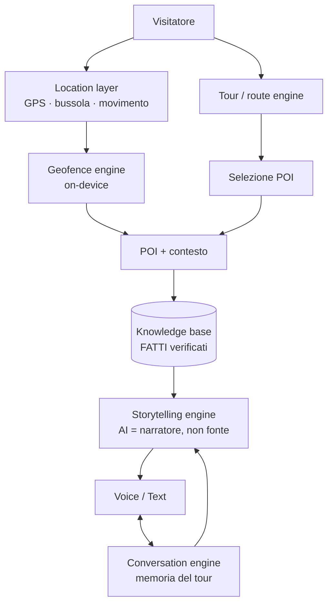
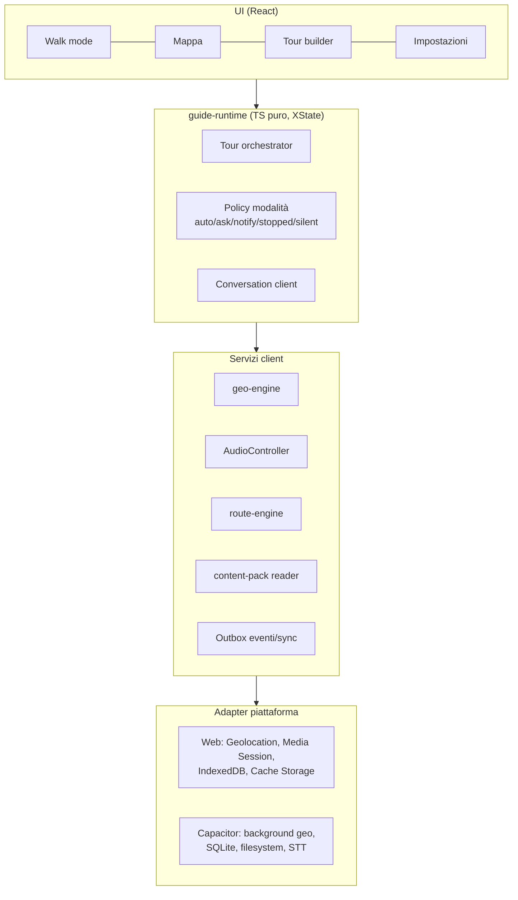
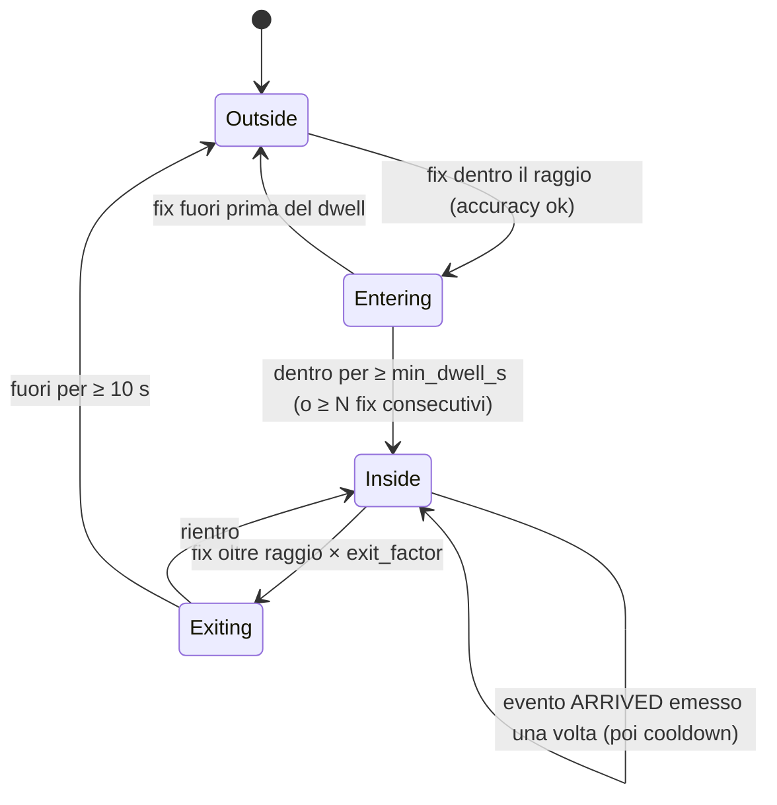
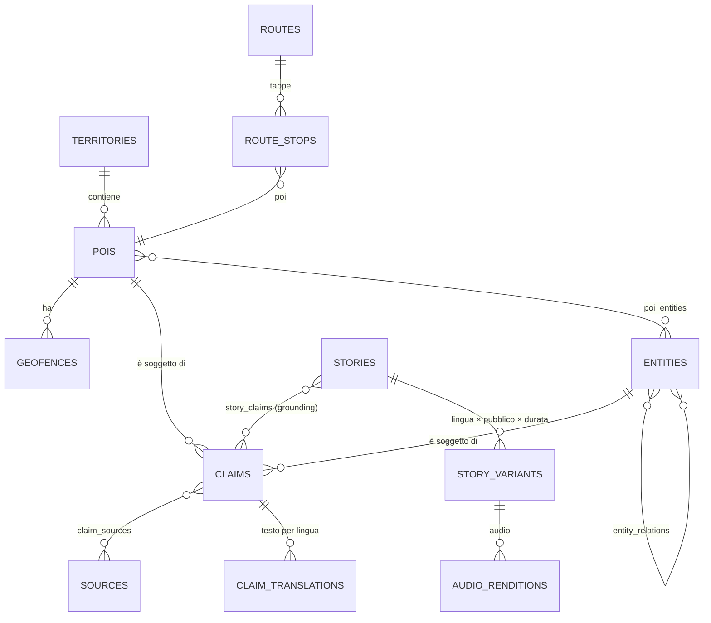
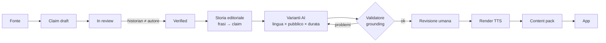
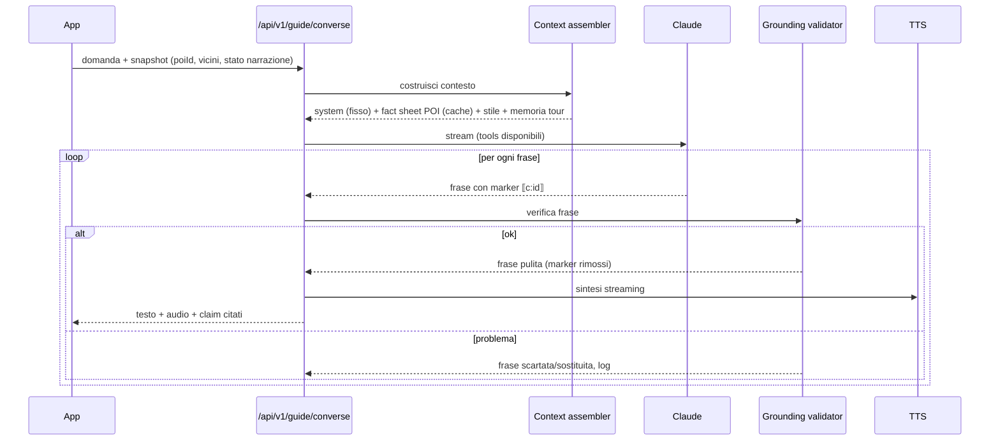
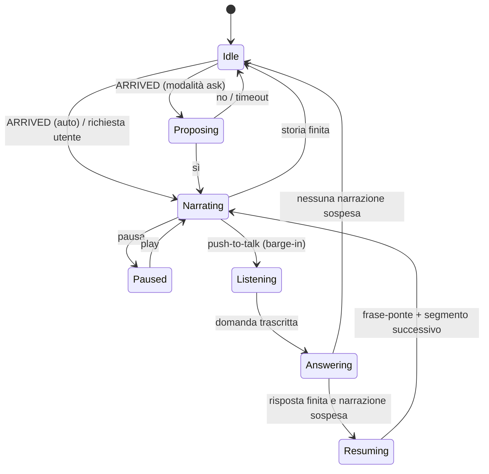
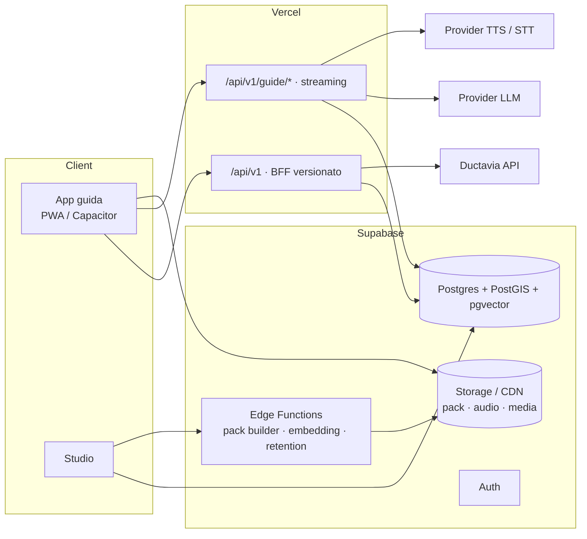

# AI Tourist Guide — Architettura (v0.1)

> **Stato: superata in parte dalla v0.2** ([strategia di prodotto e architettura](../v0.2-product-strategy/PRODUCT-STRATEGY-AND-ARCHITECTURE.md)).
> Restano validi i principi su verifica dei fatti, geofencing sul dispositivo, offline, audio e privacy;
> il modello dati e la struttura dei contenuti sono rivisti nella v0.2 (sezione "Revisione dell'architettura v0.1").

> Guida turistica AI che **accompagna fisicamente** il visitatore e **racconta** il luogo.
> Non è un travel planner, non è un booking engine, non è un chatbot di consigli.
> Priorità: **cultura + storia + storytelling + posizione**.

File correlati:
- [`schema.sql`](./schema.sql): schema Supabase/PostgreSQL completo (validato su Postgres 16 + PostGIS + pgvector)
- [`ai-tools.ts`](./ai-tools.ts): definizioni dei tool della guida AI (tipizzate con `@anthropic-ai/sdk`)

---

## Indice

0. [Principi e decisioni chiave](#0-principi-e-decisioni-chiave)
1. [Frontend architecture](#1-frontend-architecture)
2. [GPS / location layer](#2-gps--location-layer)
3. [Geo-fencing system](#3-geo-fencing-system)
4. [POI database](#4-poi-database)
5. [Historical knowledge base](#5-historical-knowledge-base-facts)
6. [CMS ("Studio")](#6-cms-studio)
7. [AI storytelling engine](#7-ai-storytelling-engine)
8. [Conversational engine](#8-conversational-engine)
9. [TTS / audio architecture](#9-tts--audio-architecture)
10. [Route / tour engine](#10-route--tour-engine)
11. [User profile](#11-user-profile)
12. [Multilingual architecture](#12-multilingual-architecture)
13. [Offline capability](#13-offline-capability)
14. [Caching](#14-caching)
15. [Analytics](#15-analytics)
16. [GDPR / privacy (e AI Act)](#16-gdpr--privacy-e-ai-act)
17. [API architecture](#17-api-architecture)
18. [AI tools](#18-ai-tools)
19. [Integrazione Ductavia](#19-integrazione-ductavia-separata)
20. [Esempio end-to-end: San Pietro](#20-esempio-end-to-end-chiesa-di-san-pietro)
21. [Roadmap](#21-roadmap)
22. [Rischi e decisioni aperte](#22-rischi-e-decisioni-aperte)

---

## 0. Principi e decisioni chiave

### 0.1 Modello concettuale



### 0.2 Le dieci decisioni che reggono tutto il resto

| # | Decisione | Perché |
|---|---|---|
| 1 | **Fatti e narrazione sono due livelli separati.** I fatti sono *claim* atomici, citati, verificati da una persona diversa da chi li ha scritti. L'AI riceve solo claim verificati e deve citarli. | L'AI non è mai la fonte primaria della verità storica. |
| 2 | **Il contenuto base è pre-generato, rivisto e pre-registrato.** L'AI generativa live serve per domande, adattamenti di stile e raccordi. | Qualità controllata, costi bassi, funziona offline. |
| 3 | **Il geofencing gira sul dispositivo**, mai sul server. | Privacy (nessuna traccia GPS sul server), offline, latenza zero. |
| 4 | **Offline-first:** ogni territorio è un *content pack* scaricabile (dati + audio + mappa). | La connessione nei borghi e sulle scogliere non è affidabile. |
| 5 | **La posizione restringe il contesto.** Il fact sheet del POI corrente (decine di claim) sta tutto nel prompt: niente RAG per la maggior parte delle domande. | Meno allucinazioni, meno latenza, cache del prompt efficace. |
| 6 | **Territori gerarchici generici** (country > region > area > destination > district). Nessun riferimento a Portovenere nel codice. | Espansione: Golfo dei Poeti → Cinque Terre → Liguria → Toscana → Italia. |
| 7 | **Le narrazioni sono transcreate per lingua**, non tradotte; i fatti strutturati (date, nomi, numeri) restano identici. | Storytelling adatto al pubblico, verità invariata. |
| 8 | **"Phone in pocket" richiede un guscio nativo.** Si parte con una PWA (validazione rapida), poi la stessa codebase React va in Capacitor per geofencing e audio in background. | Limiti reali del web su iOS (vedi §1.2). |
| 9 | **Repository, progetto Supabase e progetto Vercel separati** da Ductavia e dal configuratore di esperienze attuale. Integrazioni solo via API con un adapter. | Prodotti distinti, nessuna contaminazione di dominio o di dati personali. |
| 10 | **Il commerciale non tocca lo storytelling.** I suggerimenti di esperienze passano da un tool opzionale, soggetto a consenso e limiti, mai durante una narrazione. | Credibilità culturale della guida. |

### 0.3 Dove vive il codice

Struttura proposta per questo repository (monorepo):

```
ai-tourist-guide/
├── apps/
│   ├── guide/            # App visitatore — Next.js (PWA) → Capacitor (iOS/Android)
│   └── studio/           # CMS redazionale — Next.js (auth staff)
├── packages/
│   ├── domain/           # Tipi + schemi zod condivisi (POI, Claim, Story, Tour…), contratti API
│   ├── geo-engine/       # Filtro GPS, geofence state machine, bearing, stop detection (TS puro, testabile)
│   ├── guide-runtime/    # Orchestratore del tour: state machine narrazione/conversazione, policy modalità
│   ├── route-engine/     # Pianificazione tour dinamici (orienteering problem), gira anche offline
│   ├── content-pack/     # Formato pack, builder (server) e reader (client)
│   ├── audio/            # AudioController, coda priorità, Media Session, astrazione TTS/STT
│   ├── narrative/        # (server) Context assembly, prompt, validatore di grounding
│   └── ui/               # Design system condiviso
├── supabase/
│   ├── migrations/       # da schema.sql
│   └── functions/        # Edge Functions (pack builder, embedding, retention job)
└── turbo.json
```

Riutilizzabile dal repo `portovenere-experiences`: setup `next-intl` + script di traduzione con Lara (`src/scripts/translate-messages.mjs`), pattern dei repository Supabase (`src/lib/supabase/*`), editor TipTap dell'admin, gate di accesso admin (`middleware.ts`), integrazione iubenda.

---

## 1. Frontend architecture

### 1.1 Principio UX: la guida è il prodotto, la mappa è secondaria

Tre superfici, in ordine di importanza:

1. **Walk mode** (schermata principale): una card del POI corrente/prossimo, un grande pulsante play/pausa, un pulsante microfono push-to-talk, "Cosa sto guardando?", sottotitoli opzionali. Utilizzabile con una mano, ad alto contrasto (sole), font grandi. Pensata per essere guardata il meno possibile.
2. **Auricolari / lock screen**: play/pausa/avanti/indietro tramite Media Session API (web) o controlli nativi. In un tour curato, "avanti" sugli auricolari = prossima storia/tappa → il tour funziona **anche senza GPS e con il telefono in tasca**.
3. **Mappa**: posizione, POI (visitati/disponibili), percorso. Si apre su richiesta.

Altre schermate: onboarding + consensi, home destinazione (download pack, tour suggeriti, "ho X minuti"), tour builder (tempo + interessi), impostazioni guida (modalità, lunghezza, voce, velocità, pubblico), libreria (pack scaricati).

### 1.2 PWA vs nativo: valutazione onesta

| Capacità | PWA (Safari iOS) | PWA (Chrome Android) | Capacitor nativo |
|---|---|---|---|
| GPS a schermo acceso | ✅ | ✅ | ✅ |
| GPS / geofence a **schermo bloccato** | ❌ JS sospeso | ⚠️ inaffidabile | ✅ region monitoring iOS (max 20 regioni), Geofencing API Android (max 100) |
| Audio continuo a schermo bloccato | ⚠️ funziona se l'audio era già in riproduzione | ✅ | ✅ |
| Notifica "sei arrivato a San Pietro" in tasca | ❌ | ⚠️ | ✅ notifica locale |
| Storage offline persistente | ⚠️ Safari può cancellare i dati dei siti non installati dopo 7 giorni di inattività | ✅ con `storage.persist()` | ✅ filesystem nativo |
| Riconoscimento vocale | ⚠️ Web Speech limitato | ⚠️ | ✅ on-device (anche offline per it/en su iOS) |
| Distribuzione | link/QR, nessuno store | idem | App Store / Play Store |

**Raccomandazione:**

- **Fase 1 — PWA** (Next.js): validare contenuti, storytelling, UX, interesse. Modalità supportate: tour curato con "avanti" dagli auricolari (funziona in tasca), geofence a schermo acceso con Wake Lock API, Q&A online. Ingresso da QR code sul territorio (Porta del Borgo, imbarchi, hotel).
- **Fase 2 — Capacitor**: stesso codice React incapsulato in un guscio nativo con plugin per background geolocation, geofence nativi, SQLite, filesystem, STT on-device, notifiche locali. Il "phone in pocket" vero arriva qui.

Vincolo che ne deriva: **il runtime della guida deve essere client-side** (nessuna dipendenza da SSR nelle schermate del tour), così l'app può essere esportata staticamente in Capacitor. Le pagine pubbliche/SEO (scheda POI, landing di destinazione) restano SSR su Vercel.

Alternativa considerata: Expo/React Native. Migliore esperienza nativa, ma richiede una seconda codebase UI. Da rivalutare solo se Capacitor mostra limiti di performance (mappa + audio) sui dispositivi di fascia bassa.

### 1.3 Stack frontend

| Area | Scelta | Note |
|---|---|---|
| Framework | Next.js (App Router) + React + TypeScript | coerente con lo stack attuale |
| Stato del tour | **XState** (state machine) | la guida *è* una macchina a stati: idle → proposta → narrazione → interruzione → risposta → ripresa |
| Stato UI leggero | Zustand | preferenze, UI effimera |
| Dati online | TanStack Query | stale-while-revalidate |
| Store locale | Interfaccia `LocalStore` → IndexedDB (Dexie) su PWA, SQLite su Capacitor | stessa API per entrambi |
| Mappa | MapLibre GL JS + **PMTiles** (tile vettoriali OSM ritagliati sul territorio) | funziona offline, nessun costo per tile; attribuzione OSM obbligatoria |
| Service Worker | Serwist (successore di next-pwa) | app shell + strategia cache |
| i18n UI | next-intl (già in uso) | |
| Styling | Tailwind (già in uso) | |

### 1.4 Architettura a livelli del client



Gli adapter di piattaforma sono l'unico punto che cambia tra PWA e nativo.

---

## 2. GPS / location layer

### 2.1 Responsabilità

Produrre uno stream affidabile di `LocationSnapshot`:

```ts
interface LocationSnapshot {
  lat: number; lng: number;
  accuracyM: number;
  speedMps: number | null;
  headingDeg: number | null;       // direzione di marcia (GPS)
  compassDeg: number | null;       // direzione dello sguardo (bussola)
  motion: "stationary" | "walking" | "vehicle" | "unknown";
  territoryId: string | null;      // territorio in cui si trova (pack caricato)
  timestamp: number;
}
```

### 2.2 Pipeline

1. **Acquisizione**: `watchPosition` (web) o plugin background (nativo). Frequenza adattiva: alta quando si è vicini a un geofence, bassa quando si cammina lontano dai POI, ferma quando si è stazionari per molto (risparmio batteria).
2. **Filtro qualità**: scarto dei fix con `accuracy` > soglia (default 35 m, configurabile per geofence). Nei caruggi di Portovenere il multipath tra edifici alti degrada il GPS: meglio un fix in meno che un trigger sbagliato.
3. **Smoothing**: filtro di Kalman semplice (posizione + velocità) per eliminare i salti.
4. **Motion detection**: stazionario se velocità < 0,5 m/s per ≥ 15–20 s (serve per la modalità "solo quando mi fermo"); "vehicle" se > 7 m/s (es. sul battello: niente trigger, oppure modalità "dal mare" in futuro).
5. **Bussola**: `DeviceOrientationEvent` (su iOS richiede permesso esplicito con un gesto dell'utente) o sensore nativo. Serve per "cosa sto guardando?" e per scegliere tra POI vicini.
6. **Contesto territoriale**: il pack caricato fornisce i confini del territorio; se l'utente entra in un territorio di cui non ha il pack → proposta di download.

### 2.3 Permessi e consenso

- Il permesso di localizzazione si chiede **solo quando serve** (avvio del primo tour), con una schermata che spiega cosa succede: "La posizione resta sul tuo telefono. Serve a capire davanti a cosa ti trovi."
- Senza permesso, l'app funziona: tour curato con avanzamento manuale, scelta del POI dalla lista o dalla mappa.
- Su nativo: prima "mentre usi l'app", poi (solo se l'utente sceglie la modalità automatica in tasca) "sempre", con spiegazione.

---

## 3. Geo-fencing system

### 3.1 Modello dati (vedi `geofences` in `schema.sql`)

Ogni POI può avere **più geofence** di tipo diverso:

| Tipo | Uso | Esempio |
|---|---|---|
| `approach` | pre-carica i contenuti, notifica leggera opzionale | 120 m da San Pietro |
| `arrival` | "sei arrivato" → proposta o avvio narrazione | 35 m dal sagrato |
| `viewpoint` | da qui **si vede** il POI, in una direzione | dalla banchina si vede il Castello Doria verso NE |
| `interior` | sei dentro (racconto dei dettagli interni) | navata |

Forma: cerchio (`center` + `radius_m`) **o** poligono (`shape`) per caruggi, moli, piazze lunghe e strette. Parametri per geofence: `min_dwell_s`, `max_accuracy_m`, `exit_factor` (isteresi), `cooldown_min`, `priority`, `view_bearing_deg` + tolleranza.

### 3.2 Macchina a stati per geofence (on-device)



### 3.3 Risoluzione dei conflitti

Nel centro storico più geofence si sovrappongono. Ad ogni evento si calcola un punteggio per i candidati:

```
score = importance × w1
      + proximity(distanza/raggio) × w2
      + facing(bussola vs bearing del POI) × w3
      + inRouteBonus (prossima tappa del tour) × w4
      − alreadyToldPenalty × w5
      − recentlyProposedPenalty × w6
```

Vince uno solo; gli altri finiscono nel contesto come "POI vicini" (l'AI può dire "alla tua sinistra c'è anche…").

### 3.4 Modalità della guida (policy)

| Modalità | Comportamento all'evento ARRIVED |
|---|---|
| `auto` | earcon breve + avvio della narrazione `arrival_hook` (10–20 s), poi prosegue con l'introduzione se l'utente non interrompe |
| `ask` (default) | earcon + "Sei arrivato davanti a San Pietro. Vuoi che ti racconti la sua storia?" → sì/no a voce, tap o tasto degli auricolari |
| `notify_only` | solo notifica (lock screen); niente audio finché l'utente non tocca |
| `when_stopped` | l'evento resta in attesa finché `motion = stationary` dentro il geofence |
| `silent` | nessun trigger; la guida parla solo su richiesta |

Regole trasversali: mai interrompere una narrazione in corso per un nuovo POI (si accoda o si propone alla fine); niente trigger se `motion = vehicle`; "non disturbare" automatico durante le funzioni religiose se gli orari sono noti (`practical_info`).

### 3.5 Implementazione

- **PWA**: tutto in `geo-engine` (TS puro) su `watchPosition`. Indice spaziale locale: con < 500 geofence per destinazione basta una griglia geohash o `rbush`.
- **Nativo**: i geofence nativi del sistema operativo sono limitati (20 su iOS) → si registrano dinamicamente i 20 più vicini (ri-registrazione su "significant location change"). Il risveglio nativo attiva poi la stessa logica `geo-engine` per la decisione fine (dwell, conflitti, policy).
- **Test**: il `geo-engine` riceve tracce GPS registrate (file GPX di passeggiate reali a Portovenere) e produce eventi: test deterministici in CI. Nello Studio, un **simulatore** permette di "camminare" sulla mappa e vedere quali geofence scattano.

---

## 4. POI database

Tabelle principali (dettaglio in `schema.sql`): `territories`, `pois`, `poi_translations`, `poi_categories`, `geofences`, `poi_walk_matrix`, `media`, `media_links`.

Scelte importanti:

- **POI ≠ entità.** Il POI è un luogo fisico visitabile, con coordinate e geofence (Chiesa di San Pietro, Grotta Byron). Le **entità** sono ciò di cui si parla (Lord Byron, la Repubblica di Genova, la leggenda del tempio di Venere, l'abside gotica). Un POI è collegato a molte entità (`poi_entities` con un ruolo: `built_by`, `visited_by`, `legend_of`…).
- **Categorie gerarchiche** in tabella (`church` → `religious_building` → `monument`), non enum: si aggiungono categorie senza migrazioni.
- **`parent_poi_id`** per i POI annidati (Castello Doria → Torre, Mura).
- **PostGIS `geography`** per coordinate e forme; indici GiST; funzione `nearby_pois()`.
- **`poi_walk_matrix`**: tempi di cammino reali precalcolati su grafo pedonale OSM (con scale e dislivello), fondamentali per Portovenere (salita al castello) e per i tour dinamici offline.
- **Informazioni pratiche** (orari, biglietti, accessibilità) separate dai fatti storici: cambiano spesso e non devono passare dalla verifica storica.
- **`external_ids`** (Wikidata, OSM) solo come riferimento e come aiuto alla redazione, **mai** come fonte di verità pubblicata.

---

## 5. Historical knowledge base (FACTS)

### 5.1 Il claim: unità atomica di verità

Un **claim** è un'affermazione singola, verificabile, con fonti:

| Campo | Esempio *(illustrativo, da verificare)* |
|---|---|
| soggetto | POI `san-pietro` |
| topic | `dating` |
| statement (it) | "La chiesa attuale unisce una parte più antica e una parte in stile gotico genovese." |
| certainty | `established` |
| year_from / year_to | valori strutturati |
| fonti | `claim_sources` → libro, pagina, citazione |
| stato | `draft → in_review → verified` (verificatore ≠ autore, vincolo nel DB) |

I **livelli di certezza** determinano come l'AI può esprimere il fatto:

| certainty | Formula consentita (it) | (en) |
|---|---|---|
| `established` | affermazione diretta | direct statement |
| `probable` | "probabilmente", "con buona probabilità" | "probably", "most likely" |
| `debated` | "gli storici discutono se…", "secondo alcune ipotesi" | "historians debate…" |
| `traditional` | "secondo la tradizione locale" | "according to local tradition" |
| `legendary` | "si racconta che…", "la leggenda vuole che…" | "legend has it…" |

Così la domanda "È vero che qui veniva Byron?" si risponde distinguendo con precisione ciò che è documentato da ciò che appartiene alla tradizione, invece di confermare o inventare.

### 5.2 Grafo di conoscenza



### 5.3 Perché una tabella `entities` generica

Invece di `historical_people`, `historical_events`, `legends`, `artworks`, `architectural_features`, `traditions`… si usa **una tabella `entities` con `kind`** e `attributes jsonb` validati da zod per tipo:

- aggiungere un tipo (es. `shipwreck`, `recipe`) non richiede migrazioni;
- le relazioni (`entity_relations`, `poi_entities`) e i claim funzionano uniformemente su tutti i tipi;
- le query della guida ("tutto ciò che riguarda questo POI") sono una join, non dieci.

Il contro (meno vincoli a livello DB sugli attributi) si compensa con la validazione zod nello Studio e nell'API.

### 5.4 Integrità

- **Regola dei 4 occhi** imposta dal DB (`claims_four_eyes_chk`).
- **Invalidazione a cascata**: se un claim passa a `deprecated` o `rejected`, le storie pubblicate che lo usano tornano automaticamente `in_review` (trigger `claims_invalidate_stories`), e il pack successivo non le includerà finché non saranno riviste.
- **`kb_version`**: hash dello stato dei claim verificati di un territorio; finisce nei pack, nelle generazioni AI e nelle chiavi di cache.
- **Lacune di conoscenza** (`knowledge_gaps`): ogni domanda senza risposta verificata entra nel backlog redazionale, aggregata per POI. È il motore di crescita della KB guidato dai visitatori reali.

---

## 6. CMS ("Studio")

### 6.1 Build vs buy

| Opzione | Pro | Contro |
|---|---|---|
| Headless CMS (Sanity, Strapi, Directus) | editor pronto | modello claim/fonti/verifica, PostGIS, editor di geofence, generazione AI con grounding e pack builder andrebbero comunque costruiti; dati fuori da Supabase |
| Payload CMS (dentro Next.js, Postgres) | buona base, stesso stack | workflow molto specifici da forzare nel framework |
| **Studio custom (Next.js + Supabase)** ✅ | modellato sul dominio, RLS unica, riuso dei pattern dell'admin attuale | più sviluppo iniziale |

**Raccomandazione: Studio custom**, perché il valore del prodotto sta proprio nel workflow redazionale (fatti → verifica → storie → audio → pack).

### 6.2 Moduli dello Studio

1. **Territori e POI**: editor su mappa (MapLibre + strumenti di disegno) per punti, cerchi e poligoni dei geofence; simulatore di camminata.
2. **Fonti**: bibliografia con livello di affidabilità A/B/C.
3. **Claims workbench**: creazione di claim atomici con fonte obbligatoria; coda di verifica per il ruolo `historian`; storico delle versioni.
4. **Entità**: persone, eventi, leggende, opere, con relazioni.
5. **Storie**: editor con **collegamento frase → claim** (evidenziando una frase si sceglie il claim che la supporta); segmentazione per interruzione/ripresa; frase-ponte per ogni segmento.
6. **Generatore di varianti AI**: dalla storia approvata → varianti per lingua × pubblico × durata. Ogni variante arriva con il **report di grounding** (claim usati, frasi senza supporto, numeri/date non trovati) e va approvata da una persona.
7. **Audio**: render TTS, ascolto, rigenerazione, lessico di pronuncia.
8. **FAQ**: domande frequenti per POI (alimentano l'offline e la cache).
9. **Itinerari**: tappe, storie di transizione, tracciato.
10. **Pack**: build, diff con la versione precedente, pubblicazione.
11. **Inbox**: lacune di conoscenza, segnalazioni di errore dei visitatori, fallimenti del validatore.
12. **Insight**: metriche per POI e per storia (completamento, punti di abbandono, domande frequenti).

### 6.3 Ruoli e workflow

Ruoli: `admin`, `editor`, `historian` (verifica i claim), `translator`, `reviewer` (approva le varianti). Ruoli limitabili a un territorio (`staff_members.territory_id`): utile quando entreranno redazioni locali o partner istituzionali.



---

## 7. AI storytelling engine

### 7.1 Due modalità di generazione

| | **A. Editoriale (offline, nello Studio)** | **B. Live (runtime, nell'app)** |
|---|---|---|
| Quando | prima della pubblicazione | durante la visita |
| Cosa | varianti delle storie, FAQ, transcreation | risposte, stili su richiesta, raccordi |
| Controllo | validatore + **revisione umana** | validatore automatico frase per frase |
| Output | testo → audio pre-registrato → pack | testo in streaming → TTS in streaming |
| Offline | ✅ (il risultato è nel pack) | ❌ (fallback FAQ/storie) |
| Costo | una tantum (Batch API: −50%) | per domanda (mitigato da cache) |

**Regola:** se esiste una storia approvata che soddisfa la richiesta, si riproduce quella (`play_story`). La generazione live entra in gioco solo quando serve davvero (domanda specifica, stile non previsto, combinazione di temi).

### 7.2 Richiesta narrativa

```ts
interface NarrativeRequest {
  intent: "narrate" | "answer" | "bridge" | "summarize";
  poiId: string | null;
  focus: string | null;              // "architettura", "Byron", "perché qui"
  style: {
    targetSeconds: number;           // 30 | 90 | 180
    audience: "general" | "family" | "kids" | "expert";
    tone: "storyteller" | "concise" | "playful" | "scholarly";
    locale: string;
  };
  toldClaimIds: string[];            // per non ripetersi
  conversation: ConversationSnapshot;  // §8
}
```

"Raccontamela in 30 secondi", "come una guida", "per mio figlio di 10 anni", "dettagli architettonici", "una curiosità" diventano valori di `style` e `focus`. **I fatti non cambiano: cambiano selezione, ordine, lunghezza, lessico e tono.**

### 7.3 Pipeline live



### 7.4 Assemblaggio del contesto (ordine pensato per la cache del prompt)

1. **System prompt fisso** (identico per tutti): ruolo, contratto di grounding, regole di certezza, regole di stile, regole sui suggerimenti partner.
2. **Tool** (ordine stabile).
3. **Fact sheet del POI corrente** (da `poi_fact_sheet()`): stabile per POI e lingua → **condiviso in cache tra tutti i visitatori davanti a quel POI**.
4. **Contesto dinamico**: POI vicini (nome, distanza, direzione), stato del tour, claim già raccontati, preferenze di stile, riassunto della memoria del tour.
5. **Turni recenti** + domanda.

### 7.5 Il contratto di grounding (estratto del system prompt)

> Sei una guida turistica che accompagna il visitatore a piedi. Racconti in modo vivo e naturale, ma **ogni affermazione fattuale deve provenire dal FACT SHEET o dai risultati dei tool**.
> - Dopo ogni frase che contiene un fatto, aggiungi il marker ⟦c:ID⟧ del claim (o dei claim) che la supportano.
> - Non introdurre date, numeri, nomi di persone, luoghi o eventi che non compaiono nei claim forniti.
> - Esprimi ogni claim secondo il suo livello di certezza (tabella…). Le leggende sono sempre presentate come leggende.
> - Se la risposta non è nei claim, dillo con naturalezza ("Su questo non ho informazioni verificate"), offri ciò che sai di pertinente e chiama `log_knowledge_gap`.
> - Puoi usare descrizioni sensoriali del presente (luce, vista, suoni) solo se generiche e non fattuali ("guarda verso il mare…").
> - Non dare consigli commerciali; usa `get_related_experiences` solo secondo le sue regole.

### 7.6 Validatore di grounding

Gira sul server, frase per frase, prima del TTS:

1. **Marker**: ogni frase con contenuto fattuale ha almeno un `⟦c:id⟧`, e ogni id appartiene all'insieme fornito in questa richiesta.
2. **Numeri e date**: estrazione con regex (anni, secoli in cifre e in lettere, "XII secolo", numeri) → devono comparire nei claim citati (valori strutturati `year_from/year_to/numeric_value` o testo).
3. **Nomi propri**: confronto con il dizionario di entità e alias del territorio (`entity_translations.aliases`); un nome noto non presente nei claim citati, o un nome sconosciuto con iniziale maiuscola in posizione non iniziale → segnalazione.
4. **Certezza**: claim `legendary`/`traditional` citati senza una formula di attribuzione → riscrittura o scarto.

Esito: frase passata, frase scartata (sostituita con un raccordo neutro), o risposta interrotta con fallback ("Lascia che ti racconti ciò che sappiamo con certezza…" + storia approvata). Tutto viene registrato in `ai_generations` e i fallimenti arrivano nell'inbox dello Studio. Il costo di latenza è basso perché si valida una frase mentre il modello genera la successiva.

### 7.7 Modello e parametri

- **Modello**: `claude-opus-5-5` per entrambe le modalità, configurabile per route.
  - Live Q&A: streaming, `output_config.effort: "low"` (latenza da conversazione a voce), fact sheet in cache.
  - Editoriale: `effort: "high"`, Batch API per generare in blocco le varianti di un territorio.
  - Prima di introdurre un secondo modello più economico per il live (es. Claude Haiku 5.5) conviene misurare: spesso il modello più capace a effort basso regge qualità e latenza, e un solo modello significa un solo namespace di cache.
- **Thinking**: su Opus 5.5 è sempre adattivo; l'effort è la manopola.
- **Rifiuti**: gestire `stop_reason: "refusal"` e attivare il fallback lato server (`fallbacks: "default"`) per non lasciare il visitatore senza risposta.
- **Prompt caching**: breakpoint dopo il fact sheet; verificare `usage.cache_read_input_tokens` in produzione.
- **Astrazione**: il package `narrative` espone un'interfaccia `NarrativeModel`; la logica di grounding è indipendente dal provider.

---

## 8. Conversational engine

### 8.1 Macchina a stati della guida



### 8.2 Interruzione e ripresa

Ogni variante narrativa è divisa in **segmenti** (`story_variants.segments`), ciascuno con i propri claim e una **frase-ponte** (`resume_hook`), anche pre-registrata.

1. Il visitatore preme il microfono → la narrazione va in pausa; si salva il cursore (`segment_id`, offset).
2. "Aspetta. Perché si chiama Portovenere?" → risposta live (o FAQ offline).
3. Ripresa:
   - se la risposta ha già coperto i claim del segmento successivo → si salta quel segmento (`resume_narration(skip_covered: true)`);
   - altrimenti si riproduce la frase-ponte ("Come ti stavo raccontando, …") e si riprende **dall'inizio del segmento interrotto**, non dal punto esatto (più naturale).
   - le frasi-ponte pre-registrate fanno funzionare la ripresa anche offline.

### 8.3 Memoria limitata al tour

```ts
interface ConversationSnapshot {
  tourId: string;
  currentPoiId: string | null;
  narration: { storyVariantId: string; segmentId: string; status: "playing" | "paused" | "interrupted" } | null;
  recentTurns: Turn[];        // ultimi 6–10 turni
  summary: string | null;     // riassunto progressivo oltre la finestra
  toldClaimIds: string[];     // cosa è già stato raccontato (anche dalle storie audio)
  style: NarrativeRequest["style"];
}
```

- Il **dispositivo è la fonte di verità** della sessione; il server è stateless e riceve lo snapshot a ogni richiesta (funziona con connessioni intermittenti e senza account).
- Dati utili e non personali: `toldClaimIds` evita ripetizioni ("come ti dicevo al castello…" è possibile perché la memoria contiene i POI visitati).
- Fine tour → la memoria viene cancellata dal dispositivo; lato server i turni si salvano **solo con consenso** (`profiles.store_conversations`) e per massimo 30 giorni.

### 8.4 Comandi locali senza AI

Riconosciuti sul dispositivo con una grammatica semplice per lingua (funzionano offline e a latenza zero): "pausa", "continua", "ripeti", "più lento", "salta", "prossima tappa", "basta così", "cosa sto guardando". Solo le domande vere vanno al modello.

### 8.5 Domande offline

1. Matching della domanda trascritta con le parafrasi delle **FAQ** del POI e dei vicini (indice MiniSearch nel pack; in futuro embedding on-device).
2. Se c'è un match sopra soglia → risposta pre-registrata.
3. Altrimenti → "Ora non ho connessione: ti rispondo appena torna la rete" + domanda in coda + proposta di una storia correlata disponibile offline.

---

## 9. TTS / audio architecture

### 9.1 Tre sorgenti audio

| Sorgente | Uso | Qualità | Offline |
|---|---|---|---|
| **Pre-registrato** (TTS neurale premium, renderizzato in fase editoriale, eventualmente voce umana per i POI principali) | storie, frasi-ponte, FAQ, earcon | massima, voce coerente "di marca" | ✅ |
| **TTS in streaming** | risposte live | alta | ❌ |
| **TTS del dispositivo** (Web Speech / AVSpeechSynthesizer / Android TTS) | fallback per testi senza audio | discreta | ✅ |

Il provider TTS è dietro un'interfaccia (`TtsProvider`): la scelta va fatta con un test d'ascolto in italiano e inglese su nomi locali (Portovenere, Doria, Palmaria, caruggi) e sul supporto ai **timestamp per segmento**.

### 9.2 AudioController (unico, con coda a priorità)

Priorità: risposta live > proposta/earcon > narrazione > transizione.

Funzioni: play, pausa, ripresa, skip segmento, indietro 10 s, velocità 0,75–1,5× (pitch preservato), volume, ducking, sottotitoli sincronizzati (dai `segment_timings`). Integrazione con **Media Session API**/controlli nativi: titolo, immagine del POI sul lock screen, avanti/indietro dagli auricolari.

### 9.3 Formati e dimensioni

- AAC-LC/HE mono 48 kbps (≈ 0,36 MB/min), compatibile ovunque.
- Stima pack Portovenere (≈ 30 POI, 3 varianti per POI, ~1,5 min di media, 1 lingua): 30 × 3 × 1,5 × 0,36 ≈ **50 MB** di audio. Pack `lite` (solo arrival hook + introduzione): ≈ 15 MB.
- Ogni file è content-addressed (hash nel nome) → cache illimitata su CDN e su dispositivo.

### 9.4 Voce in ingresso (STT)

- **Push-to-talk** (tap sulla walk mode; su nativo anche gesto dagli auricolari dove possibile). Nessun ascolto continuo (privacy, batteria, rumore).
- PWA: STT su server in streaming (provider dietro interfaccia). Nativo: riconoscimento on-device di sistema quando disponibile (anche offline per it/en su iOS), fallback server.
- L'audio della voce non viene mai salvato.

### 9.5 Budget di latenza per una risposta a voce

| Fase | Obiettivo |
|---|---|
| Fine parlato → testo | 300–700 ms |
| Primo token del modello (prefisso in cache, effort basso) | ~1 s |
| Prima frase validata → primo audio TTS | 300–500 ms |
| **Totale fino alla prima parola** | **≈ 2–2,5 s** |

Per mascherare l'attesa: earcon breve "sto pensando" e, per domande riconosciute come FAQ, risposta immediata pre-registrata.

---

## 10. Route / tour engine

### 10.1 Itinerari curati

Definiti nello Studio (`routes`, `route_stops`): tappe ordinate, tempi di sosta, **storie di transizione** da ascoltare camminando tra una tappa e l'altra (es. tra la Porta del Borgo e San Pietro, il racconto dei caruggi). Esempio: "Portovenere in 60 minuti" — Porta del Borgo → Caruggi → San Pietro → Grotta Byron → Castello Doria.

### 10.2 Tour dinamici ("ho solo 30 minuti")

È un **Orienteering Problem**: massimizzare il valore dei POI visitati entro un budget di tempo.

```
valore(POI) = importance × (1 + match interessi) × novità (non ancora visitato)
costo       = tempo di cammino (poi_walk_matrix, con dislivello) + sosta suggerita
vincolo     = Σ costo ≤ budget (con margine 10–15%), eventuale punto di arrivo (imbarco traghetto)
```

Algoritmo: inserimento greedy per rapporto valore/costo + miglioramento 2-opt. Con decine di POI per destinazione richiede millisecondi e **gira sul dispositivo**, quindi offline. Dalla posizione attuale al primo POI: distanza × fattore di deviazione (≈1,3) + penalità di pendenza (funzione di Tobler).

**Ripianificazione continua**: se il visitatore si ferma più a lungo, salta tappe o chiede "mi restano 20 minuti", il tour si ricalcola togliendo le tappe a minor valore. Il percorso narrativo si adatta: storie più brevi se il tempo stringe.

### 10.3 Indicazioni

Non navigazione turn-by-turn ma indicazioni da guida: "La prossima tappa è il castello: 6 minuti in salita, circa 120 gradini. Tieni le mura sulla sinistra." (generate da `poi_walk_matrix` + note redazionali). Tracciato visibile sulla mappa.

---

## 11. User profile

- **Anonimo per default** (Supabase anonymous sign-in): si può fare un tour senza registrazione. Account opzionale (email/Apple/Google) per sincronizzare pack, storico e preferenze su più dispositivi.
- **Preferenze** (`profiles`): lingua, modalità guida, pubblico predefinito, lunghezza narrazioni, interessi pesati, voce, velocità, accessibilità (evitare scale, sottotitoli sempre attivi).
- **Override per tour**: "oggi sono con i bambini" cambia il pubblico solo per quel tour.
- **Inferenza leggera degli interessi**: se il visitatore chiede spesso di architettura, il peso aumenta nel tour corrente (sul dispositivo; salvato nel profilo solo con consenso alla personalizzazione).
- **Niente account per minori** (età del consenso digitale in Italia: 14 anni). La modalità "bambini" è uno stile narrativo, non un account.

---

## 12. Multilingual architecture

### 12.1 Livelli

| Livello | Come si gestisce |
|---|---|
| UI | next-intl + pipeline di traduzione già esistente (Lara) |
| Dati strutturati (nomi, descrizioni brevi, didascalie) | tabelle `*_translations` tipizzate, con flag `reviewed` |
| **Claim** | `claim_translations`: traduzione **fedele** e rivista (sono fatti) |
| **Storie** | `story_variants` per lingua: **transcreation** dai claim, non traduzione della storia italiana |
| Audio | voce e lessico di pronuncia per lingua |
| Risposte live | generate direttamente nella lingua del visitatore dai claim |

### 12.2 Transcreation

La variante inglese di una storia non è la traduzione di quella italiana: viene generata dagli **stessi claim** con note culturali per pubblico (`locale_notes` nella richiesta di generazione), ad esempio spiegare cos'è un "caruggio" o la Repubblica di Genova a chi non la conosce, mantenendo invariati date, nomi e certezze. Un glossario per lingua stabilisce i termini da non tradurre (caruggi, focaccia…).

### 12.3 Tier linguistici (`locales.content_tier`)

| Tier | Lingue | Contenuti |
|---|---|---|
| 1 | it, en | storie curate, revisione redazionale, audio pre-registrato, FAQ |
| 2 | fr, de, es (fase 3) | varianti generate dall'AI e riviste da madrelingua, audio pre-registrato |
| 3 | tutte le altre | solo risposte live generate dai claim (avviso: "risposte generate automaticamente"), TTS in streaming |

Catena di fallback per i testi: lingua richiesta → en → it.

---

## 13. Offline capability

### 13.1 Content pack

Un pack per **territorio × lingua × variante (`lite`/`full`)**, versionato:

```
portovenere-it-full-v12/
├── manifest.json        # versione, schema_version, min_app_version, kb_version, file con sha256 e byte
├── content.sqlite       # (o shard JSON su PWA) POI, geofence, claim verificati, storie + segmenti,
│                        #   FAQ, itinerari, walk matrix, entità, info pratiche
├── search.json          # indice MiniSearch (FAQ, POI, entità) per la ricerca offline
├── audio/<hash>.m4a     # storie, frasi-ponte, FAQ, earcon
├── images/<hash>.webp   # ridimensionate per mobile
└── map.pmtiles          # tile vettoriali del territorio (z12–z18, qualche MB)
```

### 13.2 Build e distribuzione

- **Pack builder** (Edge Function o job schedulato) parte alla pubblicazione: legge solo contenuti `published`/`verified`, genera i file, calcola gli hash, carica su Storage/CDN, registra `content_packs`.
- **Delta update**: il client confronta il manifest e scarica solo i file con hash nuovo.
- **Quando scaricare**: proposta in home ("Scarica Portovenere · 48 MB · consigliato Wi-Fi"), QR code in hotel/porto, download automatico del `lite` all'avvio del primo tour, prefetch silenzioso del POI successivo quando c'è rete.

### 13.3 Lato client

- App shell in cache tramite Service Worker (Serwist).
- File del pack in Cache Storage/OPFS (PWA) o filesystem (nativo); dati strutturati in IndexedDB/SQLite.
- `navigator.storage.persist()` + invito all'installazione su schermata Home (su iOS è la protezione principale contro la cancellazione dei dati dei siti non installati).
- **Outbox**: eventi analytics, progressi, lacune di conoscenza e domande in sospeso vengono accodati e inviati al ritorno della rete.

### 13.4 Matrice offline

| Funzione | Offline |
|---|---|
| Mappa, posizione, POI, percorso | ✅ |
| Geofence e proposte | ✅ |
| Storie audio, frasi-ponte, transizioni | ✅ |
| Tour curati e dinamici (pianificazione) | ✅ |
| Comandi vocali base | ✅ (nativo: STT on-device) |
| Domande frequenti | ✅ (FAQ pre-registrate) |
| Domande libere all'AI | ❌ → in coda |
| Stili su richiesta non pre-generati | ❌ → variante più vicina disponibile |
| Lingue tier 3 | ❌ |

---

## 14. Caching

| Livello | Cosa | Strategia |
|---|---|---|
| CDN | file dei pack, audio, immagini | URL content-addressed, `immutable`, cache illimitata |
| Edge/API | contenuti pubblicati (`/api/v1/territories/...`) | `s-maxage` + invalidazione per tag (`revalidateTag` alla pubblicazione) |
| Prompt | system + tool + fact sheet del POI | prompt caching del modello; il fact sheet è identico per tutti i visitatori dello stesso POI e lingua |
| **Risposte** | domanda normalizzata + POI + lingua + stile + `kb_version` | cache semantica: domande simili (embedding sopra soglia) sullo stesso POI riusano risposta **e audio**. La `kb_version` nella chiave invalida tutto quando cambiano i fatti |
| TTS | hash(testo + voce + velocità) | audio salvato in Storage; le risposte ricorrenti non si risintetizzano |
| Client | dati online | TanStack Query stale-while-revalidate; pack come fonte primaria quando presente |

Effetto atteso: le domande più comuni per POI ("quanti anni ha?", "chi l'ha costruita?") convergono rapidamente su FAQ/cache, e la generazione live resta per la coda lunga.

---

## 15. Analytics

### 15.1 Cosa misurare

- **Esperienza**: tour avviati/completati, durata, modalità usate, POI raggiunti, uso offline.
- **Contenuto**: tasso di completamento per storia e **segmento di abbandono** (dove la gente salta: segnale redazionale diretto), storie più richieste, varianti preferite (30 s vs 90 s, bambini).
- **Conversazione**: domande per POI, intent più frequenti, lacune di conoscenza, feedback 👍/👎, segnalazioni "informazione errata".
- **Qualità AI**: fallimenti del validatore, latenza alla prima parola, cache hit (prompt, risposte, TTS), costo per tour.
- **Territorio**: affluenza aggregata per POI e fascia oraria (dato di valore anche per enti locali, **solo aggregato**).

### 15.2 Privacy-first

- Eventi riferiti a `poi_id`, **mai coordinate**; nessuna traccia GPS salvata.
- `session_hash` pseudonimo ruotato per tour, non `user_id`.
- Report con soglia di k-anonimato (es. ≥ 10 sessioni per cella).
- Strumento: tabella `analytics_events` + dashboard (es. Metabase) oppure PostHog in regione UE. Niente session recording nell'app della guida.

---

## 16. GDPR / privacy (e AI Act)

> Questa sezione è un'impostazione architetturale, non una consulenza legale: va validata con un consulente privacy.

### 16.1 Minimizzazione per architettura

| Dato | Dove vive | Note |
|---|---|---|
| Posizione GPS | **solo sul dispositivo** | al server arrivano `poi_id` e POI vicini; se servono coordinate (es. "cosa c'è intorno?") arrotondate a ~100 m e non salvate |
| Voce | non salvata | streaming verso STT, provider con contratto di non conservazione dove possibile |
| Conversazioni | dispositivo; server solo con consenso | retention ≤ 30 giorni, poi cancellazione o anonimizzazione; le domande di `knowledge_gaps` vengono ripulite da dati personali |
| Profilo | Supabase (UE) | anonimo per default |
| Analytics | pseudonimo per tour, aggregato | nessuna coordinata |

### 16.2 Basi giuridiche e consensi

Consensi separati e revocabili (`consents`, registro append-only con versione della policy): `location`, `conversation_storage`, `analytics`, `personalization`, `partner_suggestions`. La guida funziona anche rifiutandoli tutti (tour manuale).

### 16.3 Adempimenti

- **DPIA consigliata**: localizzazione + AI + possibile uso da parte di famiglie.
- Registro dei trattamenti; DPA con tutti i responsabili (Supabase, Vercel, provider AI, TTS, STT, analytics); regioni UE dove disponibili (Supabase Frankfurt, funzioni Vercel `fra1`).
- Diritti: esportazione e cancellazione account; per utenti anonimi pulsante "cancella i miei dati" sul dispositivo e lato server.
- **AI Act (obblighi di trasparenza)**: la guida dichiara di essere un'AI all'onboarding e lo ricorda nell'interfaccia; le risposte generate live sono distinguibili dalle storie redazionali; la voce sintetica è dichiarata.
- **Suggerimenti commerciali**: consenso specifico, etichetta chiara ("Suggerimento di esperienza locale"), nessun dato personale condiviso con Ductavia; attribuzione solo tramite codice referral.

---

## 17. API architecture

### 17.1 Panoramica



### 17.2 Perché un BFF versionato e non PostgREST diretto

Le app native restano installate per mesi in versioni diverse: l'app non deve dipendere dallo schema del DB. Il BFF (`/api/v1`) espone contratti stabili definiti con zod in `packages/domain`, da cui si genera anche un **OpenAPI** (utile per una futura API B2B di Italy Horizon). Lo Studio invece può usare il client Supabase con RLS direttamente.

### 17.3 Endpoint principali

| Metodo | Endpoint | Note |
|---|---|---|
| GET | `/api/v1/territories/:slug` | territorio, sotto-territori, lingue disponibili |
| GET | `/api/v1/territories/:slug/pois?locale=` | POI pubblicati (cache CDN) |
| GET | `/api/v1/pois/:id?locale=` | scheda POI, media, storie disponibili |
| GET | `/api/v1/routes?territory=&locale=` | itinerari curati |
| GET | `/api/v1/packs/:territory/:locale/manifest?flavor=` | manifest dell'ultimo pack compatibile con `app_version` |
| POST | `/api/v1/tours` · PATCH `/api/v1/tours/:id` | apertura/aggiornamento tour (sincronizzazione progressi) |
| POST | `/api/v1/tours/plan` | pianificazione lato server (stessa logica del client, per i casi online) |
| POST | `/api/v1/guide/converse` | **SSE**: eventi `text_delta`, `sentence`, `audio_chunk`/`audio_url`, `citations`, `client_action`, `done` |
| POST | `/api/v1/guide/narrate` | narrazione live con stile su richiesta |
| POST | `/api/v1/guide/stt` | trascrizione (PWA) |
| POST | `/api/v1/events` | batch di eventi analytics dall'outbox |
| POST | `/api/v1/reports` | "informazione errata" |
| GET | `/api/v1/experiences/suggest` | adapter Ductavia, policy-gated |

### 17.4 Trasversali

- **Auth**: JWT Supabase (anche anonimo) su tutte le chiamate AI.
- **Rate limiting** per utente/dispositivo sugli endpoint AI (Redis via Vercel Marketplace, es. Upstash); quote giornaliere per visitatore.
- **Anti-abuso**: Turnstile (già usato nel repo) sulla PWA; App Attest / Play Integrity sul nativo.
- **Osservabilità**: ogni chiamata AI registra modello, versione del prompt, `kb_version`, token, cache hit, latenza, esito del validatore (`ai_generations`).
- **Runtime**: Vercel Functions (Node) con streaming per `/guide/*`; regione UE.

---

## 18. AI tools

Definizioni complete in [`ai-tools.ts`](./ai-tools.ts). Principio: **l'AI non ha web search**. Tutto ciò che sa sul luogo arriva dai tool, che leggono solo claim verificati e restituiscono sempre `claim_id` e `certainty`.

| Gruppo | Tool | Esecuzione | Uso tipico |
|---|---|---|---|
| Contesto | `get_user_context()` | client | "cosa c'è qui intorno?" |
| | `get_nearby_pois(radius_m, category, limit, locale)` | server/locale | POI vicini con distanza e direzione |
| | `identify_visible_poi(description, bearing_deg, locale)` | server/locale | "cos'è quel castello sopra di noi?" |
| Conoscenza | `get_poi_facts(poi_id, topics, locale)` | server/locale | fact sheet di un altro POI |
| | `search_knowledge(query, scope, entity_kinds, locale)` | server | "è vero che qui veniva Byron?" |
| | `get_entity(entity_id, locale)` | server/locale | personaggi, eventi, leggende, opere |
| | `get_timeline(subject, from_year, to_year, locale)` | server/locale | "raccontami la storia dall'inizio" |
| | `get_stories(poi_id, story_type, audience, max_seconds, locale)` | server/locale | preferire storie approvate |
| | `get_sources(claim_ids)` | server/locale | "come fai a saperlo?" |
| | `get_practical_info(poi_id, locale)` | server/locale | orari, scale, accessibilità |
| Tour | `get_tour_state()` | client | "quanto manca?" |
| | `plan_tour(time_budget_min, interests, avoid_stairs, end_poi_id)` | client | "ho solo 30 minuti" |
| | `update_tour(action, poi_id)` | client | "saltiamo il castello" |
| | `get_directions(poi_id, locale)` | client | "come ci arrivo?" |
| Azioni app | `play_story(story_variant_id)` | client | riproduce audio approvato |
| | `resume_narration(skip_covered)` | client | ripresa dopo interruzione |
| | `show_on_map(poi_ids)` | client | solo se richiesto |
| Memoria | `log_knowledge_gap(question, poi_id, locale)` | server (outbox) | domanda senza risposta verificata |
| Partner | `get_related_experiences(topic, trigger, locale)` | server | solo su richiesta o a narrazione conclusa; il server applica consenso e limiti |

Note di progetto:

- Il **fact sheet del POI corrente è già nel prompt**: la maggior parte delle domande non richiede tool (meno round-trip, meno latenza).
- I tool "client" vengono restituiti dal server all'app come eventi `client_action`; l'app li esegue sul runtime locale e rimanda il risultato.
- `toldClaimIds` si aggiorna automaticamente dai marker di citazione: non serve un tool per "segnare come raccontato".
- Tutti i tool usano `strict: true` (input sempre validi rispetto allo schema) e un ordine stabile per non rompere la cache del prompt.

---

## 19. Integrazione Ductavia (separata)

- **Confine netto**: Ductavia è un altro prodotto, con il suo DB e i suoi dati personali. La guida conosce solo un'interfaccia `ExperienceSuggestionProvider` con un adapter Ductavia (anti-corruption layer) e una cache delle offerte (`partner_offers`: id esterno, temi, territorio, payload).
- **Quando si può suggerire** (policy lato server, non affidata al modello):
  1. consenso `partner_suggestions` attivo;
  2. il visitatore ha chiesto esplicitamente come approfondire, **oppure** una narrazione su un tema pertinente si è appena conclusa;
  3. massimo 1 suggerimento per tour (configurabile), mai durante una narrazione, mai nei primi minuti;
  4. pertinenza tematica: i tag dell'offerta devono corrispondere ai topic dei claim appena raccontati (es. tradizione vinicola → esperienza in cantina).
- **Presentazione**: etichetta chiara, tono distinto dalla narrazione, nessuna modifica ai contenuti culturali.
- **Feature flag**: disattivato di default nell'MVP.

---

## 20. Esempio end-to-end: Chiesa di San Pietro

> I contenuti storici qui sotto sono **segnaposto illustrativi**: nella KB reale ogni frase corrisponderà a un claim verificato con fonte.

1. **Avvicinamento** — il visitatore cammina sul molo verso la punta. Entra nel geofence `approach` (120 m): l'app pre-carica in memoria storie e fact sheet di San Pietro (già nel pack).
2. **Arrivo** — dentro il geofence `arrival` (35 m) per 8 s con accuratezza 12 m → evento `ARRIVED(san-pietro)`. Modalità `ask`: earcon + *"Sei arrivato davanti a San Pietro, uno dei simboli di Portovenere. Vuoi che ti racconti la sua storia?"*
3. **Narrazione** — "Sì" (voce o tasto degli auricolari) → si riproduce la variante `introduction · general · 90 s · it` (audio pre-registrato, 4 segmenti).
4. **Interruzione** — durante il segmento 2: *"Aspetta, ma quanti anni ha?"*
   - push-to-talk → pausa, cursore = segmento 2;
   - online: il server riceve `{poiId, narration: {segmentId: "s2"}, toldClaimIds, …}`; il fact sheet di San Pietro è già in cache;
   - risposta: *"La parte più antica risale a ⟦c:…⟧ …, mentre la parte gotica che vedi verso il mare fu aggiunta più tardi ⟦c:…⟧."* → validatore ok → TTS;
   - (offline: match con FAQ `age` → risposta pre-registrata.)
5. **Ripresa** — il segmento 3 parlava proprio della datazione → `resume_narration(skip_covered: true)` → frase-ponte del segmento 4: *"Come ti stavo raccontando, questo promontorio…"*
6. **Domanda su un altro POI** — *"Cos'è quel castello sopra di noi?"* → `identify_visible_poi("castello sopra di noi", bearing 40°)` → Castello Doria (geofence `viewpoint`, confidenza alta) → breve risposta dal suo fact sheet + *"È una delle tappe del percorso: vuoi andarci dopo la Grotta Byron?"*
7. **Domanda delicata** — *"È vero che qui veniva Byron?"* → `search_knowledge("Byron", scope: "territory")` → claim su Byron con i loro livelli di certezza → la risposta distingue ciò che è documentato da ciò che è tradizione o leggenda.
8. **Lacuna** — *"Quanti scalini ci sono fino al castello?"* senza claim né info pratica → *"Non ho un dato verificato sul numero esatto, ma è una salita impegnativa di circa X minuti"* (dalla walk matrix) + `log_knowledge_gap`.

---

## 21. Roadmap

| Fase | Obiettivo | Contenuto |
|---|---|---|
| **0 · Fondazioni** (4–6 settimane) | KB e Studio minimi | schema + migrazioni, Studio: POI/geofence su mappa, fonti, claim con verifica, storie con collegamento ai claim. **15–20 POI di Portovenere in it/en**, verificati da uno storico locale |
| **1 · MVP PWA** (6–8 settimane) | validare l'esperienza sul campo | itinerario "Portovenere in 60 minuti", audio pre-registrato, walk mode, geofence a schermo acceso, avanzamento dagli auricolari, pack offline, Q&A live con validatore, analytics base. Test con 30–50 visitatori reali |
| **2 · Nativo + intelligenza** | "phone in pocket" | Capacitor (background geofence, notifiche, SQLite, STT on-device), tour dinamici, FAQ offline, cache semantica, voce |
| **3 · Scala** | multi-territorio e multi-lingua | Golfo dei Poeti (Palmaria, Lerici, Tellaro…), fr/de/es tier 2, ruoli redazionali per territorio, API B2B (Italy Horizon), feature flag Ductavia |

KPI per il pilota: % tour completati, completamento medio delle storie, domande per tour, % risposte con grounding valido, latenza alla prima parola, segnalazioni di errore per 1000 risposte (obiettivo: ~0 sui fatti), NPS.

---

## 22. Rischi e decisioni aperte

| Tema | Rischio / domanda | Proposta |
|---|---|---|
| Contenuti | La qualità della guida dipende dalla KB: serve tempo di uno storico/ricercatore | budget dedicato in Fase 0; collaborazione con enti locali, musei, diocesi per le fonti |
| GPS | Precisione scarsa nei caruggi e sotto le mura | geofence poligonali, dwell, isteresi, test su tracce reali, fallback manuale sempre disponibile |
| iOS PWA | Niente background, possibile cancellazione storage | fase 2 nativa; in fase 1 invito all'installazione e tour avanzabile dagli auricolari |
| Latenza voce | > 3 s rovina la conversazione | cache prompt, effort basso, validazione per frase, FAQ, earcon |
| Allucinazioni | Fatti inventati nelle risposte live | grounding contract + validatore + niente web search + segnalazioni utenti + audit `ai_generations` |
| Costi AI | Crescita con i visitatori | contenuti pre-generati come base, cache semantica, prompt caching, quote per utente |
| Diritti | Immagini, testi di fonti, voce | licenze in `media.license` e `sources.license_notes`; testi parafrasati, citazioni brevi |
| Da decidere | provider TTS/STT, modello di embedding, strumento analytics, nome del prodotto | test comparativi in Fase 0–1 |

---

*Nota: la richiesta originale si interrompeva alla sezione "AI TOOLS" (`getHistorical…`); l'elenco dei tool in §18 completa quella parte seguendo la stessa logica.*
