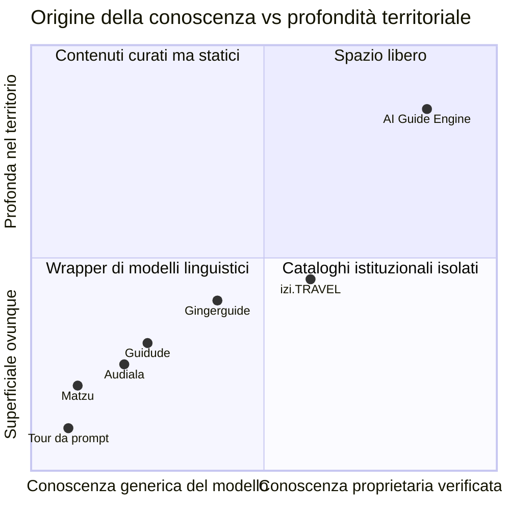
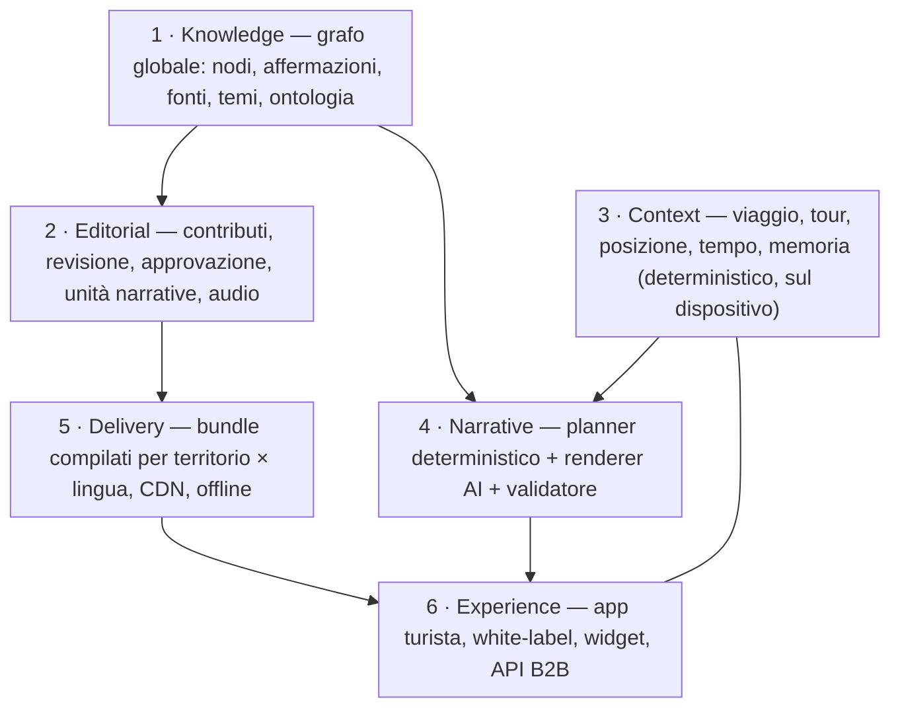
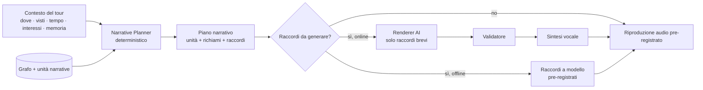
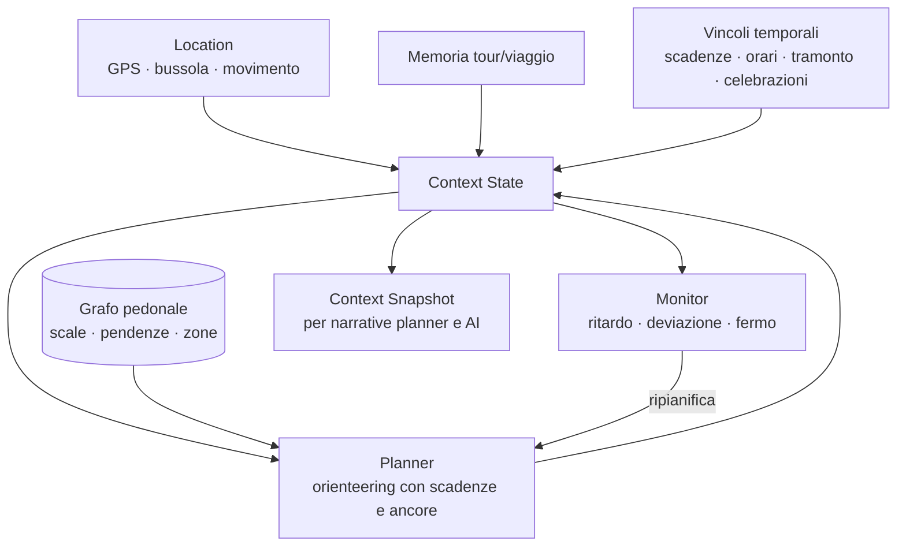
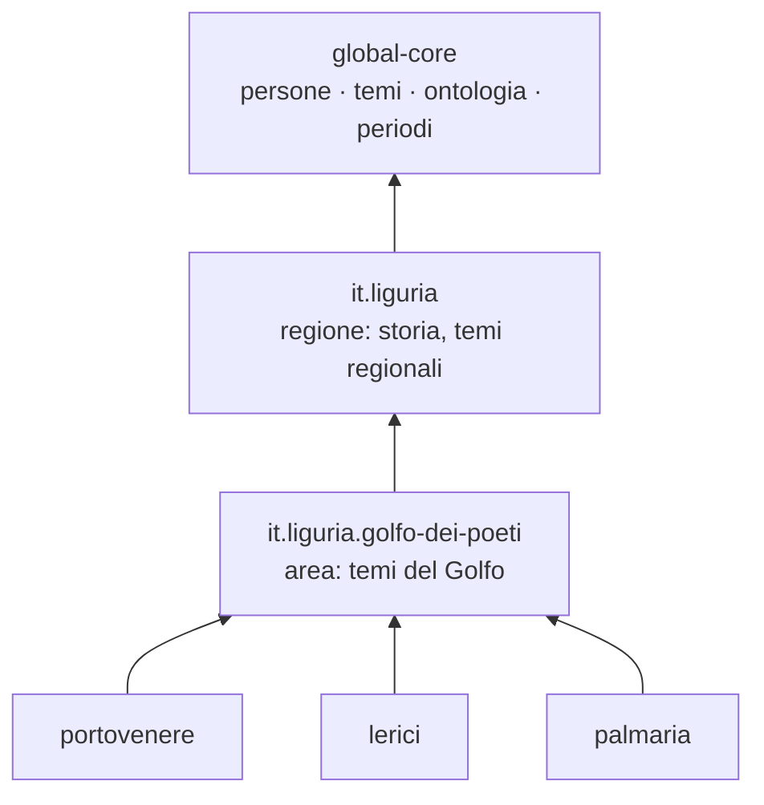
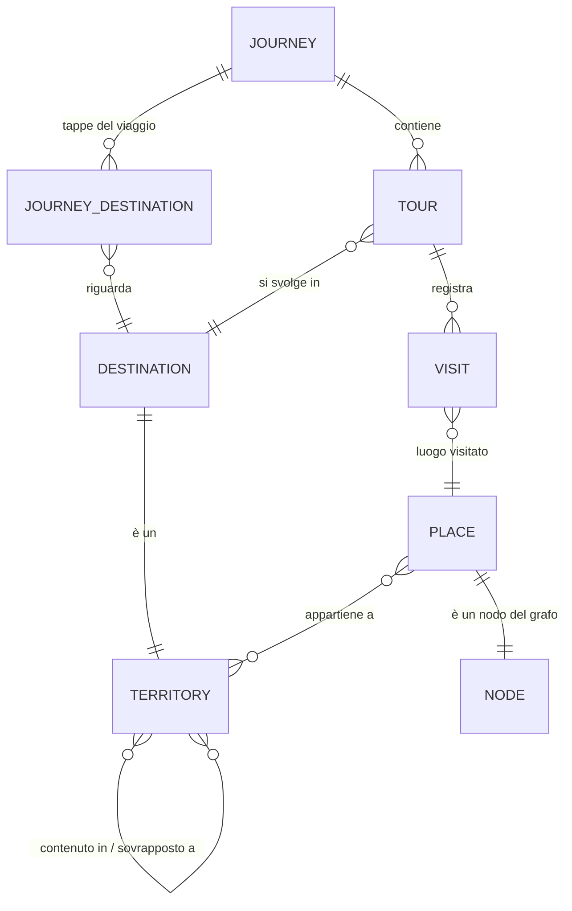
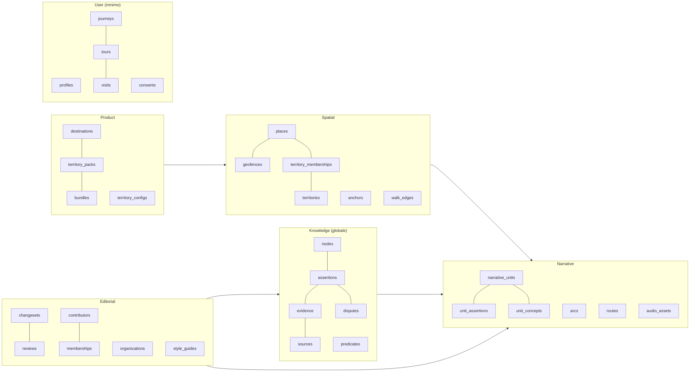

# AI Guide Engine — Strategia di prodotto e architettura (v0.2)

> Secondo passaggio. Il primo ([ARCHITECTURE.md](../v0.1-architecture/ARCHITECTURE.md), v0.1) progettava un'audioguida AI per Portovenere.
> Questo documento ripensa il progetto come **piattaforma territoriale** (AI Guide Engine) di cui Portovenere è il primo territorio e il laboratorio reale.
> Nessun codice: analisi di prodotto e di architettura.

---

## Indice

- [Sintesi in una pagina](#sintesi-in-una-pagina)
- [A. Posizionamento competitivo](#a-posizionamento-competitivo)
- [B. Differenziazione di prodotto](#b-differenziazione-di-prodotto)
- [C. Architettura core del prodotto](#c-architettura-core-del-prodotto)
- [D. Territorial Knowledge Graph](#d-territorial-knowledge-graph)
- [E. Verified Knowledge Layer](#e-verified-knowledge-layer)
- [F. AI Storytelling Engine](#f-ai-storytelling-engine)
- [G. Tour Context Engine](#g-tour-context-engine)
- [H. Territory Pack](#h-territory-pack)
- [I. Architettura multi-territorio](#i-architettura-multi-territorio)
- [J. CMS e Human Curation](#j-cms-e-human-curation)
- [K. Audio-first UX](#k-audio-first-ux)
- [L. Offline](#l-offline)
- [M. Modello dati](#m-modello-dati)
- [N. Modello API](#n-modello-api)
- [O. MVP Portovenere](#o-mvp-portovenere)
- [P. Roadmap Portovenere → Italia](#p-roadmap-portovenere--italia)
- [Q. KPI](#q-kpi)
- [R. Modelli di business](#r-modelli-di-business)
- [S. Rischi tecnici principali](#s-rischi-tecnici-principali)
- [T. Rischi competitivi principali](#t-rischi-competitivi-principali)
- [Revisione dell'architettura v0.1](#revisione-dellarchitettura-v01)
- [La domanda finale: da 1 a 1.000 territori senza riscrivere](#la-domanda-finale-da-1-a-1000-territori-senza-riscrivere)
- [Fonti della ricerca competitiva](#fonti-della-ricerca-competitiva)

---

## Sintesi in una pagina

1. **Il mercato si divide in due famiglie, e nessuna delle due ha un vantaggio difendibile.**
   - *Piattaforme di contenuti* (izi.TRAVEL): tanti contenuti prodotti da istituzioni, ma statici, a compartimenti stagni, di qualità disomogenea e senza conversazione.
   - *Wrapper di modelli linguistici* (Audiala, Guidude, Matzu, i generatori di tour "da prompt"): dinamici e conversazionali, ma la loro conoscenza è quella del modello linguistico, cioè la stessa di ChatGPT o Gemini. Si copiano in poche settimane e verranno assorbiti dagli assistenti generalisti (Gemini, ChatGPT, Apple), che già vedono posizione e fotocamera.
2. **La posizione libera è l'incrocio delle due**: conoscenza **proprietaria, verificata e relazionale** del territorio, costruita **con le istituzioni locali**, raccontata da una guida AI che **ricorda tutto il viaggio**.
3. **Il vantaggio cresce con il sistema** per tre motivi strutturali:
   - il grafo di conoscenza vale per le *relazioni*, e ogni nuovo territorio aggiunge collegamenti anche a quelli esistenti (Byron collega Portovenere, Lerici, Pisa, Ravenna);
   - le istituzioni che contribuiscono portano contenuti e legittimità che nessun modello linguistico ha;
   - le domande dei turisti generano un ciclo continuo di miglioramento dei contenuti, e un dato che interessa ai territori.
4. **Architettura**: il sistema calcola (contesto, tempo, spazio, selezione narrativa), l'AI racconta. Narrazione **componibile** (unità brevi con prerequisiti e collegamenti) invece di tracce fisse per POI o generazione tutta dal vivo. Contenuto distribuito come **pacchetti compilati su CDN**, non letto dal database a runtime.
5. **Regola di scalabilità**: zero codice specifico per territorio. Aggiungere un territorio è solo lavoro sui contenuti. Il formato del Territory Pack è l'unica porta d'ingresso dei contenuti, anche per Portovenere, fin dal primo giorno.

---

## A. Posizionamento competitivo

### A.1 Nota di metodo

Le schede che seguono si basano sulle pagine degli store, sui siti e sulla stampa (fonti in fondo), non su test sul campo delle app. Alcune informazioni dichiarate dai produttori (numero di utenti, città coperte) non sono verificabili. **"ToursAI" non risulta come prodotto identificabile**: lo tratto come rappresentante della categoria "tour generati da prompt", che include app come Strollr, iWander, Toury, AI Tourguide e Free AI Walking Tour. Prima di decisioni importanti conviene provare le app di persona: un pomeriggio a Genova o a La Spezia con ciascuna vale più di qualsiasi scheda.

### A.2 izi.TRAVEL: la piattaforma di contenuti istituzionali

- **Cosa fa**: piattaforma gratuita e aperta dove musei, uffici turistici e organizzatori pubblicano audioguide. Il turista le ascolta gratis. Dichiara migliaia di tour e musei in decine di paesi e lingue, e oltre 16.000 fornitori di contenuti. È stata finanziata da investitori (circa 22 milioni di euro dichiarati).
- **Problema che risolve**: dà alle istituzioni culturali uno strumento gratuito per pubblicare audioguide senza svilupparsi un'app.
- **Come lo vive l'utente**: cerca un museo o una città, sceglie un tour, ascolta tappe numerate, a volte attivate dal GPS. L'esperienza è quella di **un'audioguida museale portata in strada**: lineare, a senso unico, con il ritmo deciso da chi l'ha prodotta.
- **Modello di prodotto**: marketplace a due lati, con un lato offerta istituzionale. Il valore sta nel catalogo e negli strumenti gratuiti per chi pubblica.
- **Punti di forza**: rete di istituzioni, legittimità, catalogo enorme, costo zero per l'utente.
- **Limiti**:
  - ogni tour è un documento isolato: la stessa chiesa può essere descritta da cinque produttori in cinque modi, anche in contraddizione tra loro;
  - qualità molto disomogenea;
  - nessuna conversazione, nessun adattamento a tempo e interessi;
  - contenuti che invecchiano;
  - nessun livello di verifica.
- **Spazio scoperto**: le istituzioni vogliono pubblicare, ma i loro contenuti restano isole. Manca uno strato che li **colleghi, li verifichi e li renda conversazionali**.

### A.3 Audiala: copertura ampia generata dall'AI, abbonamento consumer

- **Cosa fa**: guide audio e itinerari generati dall'AI per molte città; chat; mappe e audio offline; 12 lingue. Piano gratuito (una città, poche guide al mese), abbonamento mensile o annuale, sblocco a vita di una singola città.
- **Problema che risolve**: avere "una guida per qualsiasi città" a basso costo.
- **Come lo vive l'utente**: sceglie una città, riceve un itinerario, ascolta narrazioni generate tappa per tappa, fa domande in chat. È un'esperienza **ampia e uniforme**: ogni città viene trattata allo stesso modo.
- **Modello di prodotto**: app consumer con abbonamento e acquisizione dagli store; costo dei contenuti vicino a zero grazie alla generazione automatica.
- **Punti di forza**: copertura, prezzo, funzioni offline, formula freemium chiara.
- **Limiti**:
  - i contenuti non si distinguono da ciò che direbbe qualsiasi modello linguistico;
  - accuratezza non verificabile dall'utente;
  - nessuna autorità locale alle spalle;
  - l'abbonamento si adatta male a chi viaggia pochi giorni l'anno. Il fatto che offrano anche lo sblocco della singola città lo conferma.
- **Spazio scoperto**: profondità e affidabilità nei luoghi minori, dove il modello linguistico sa poco.

### A.4 Guidude: l'esperienza "in tasca" più vicina alla nostra idea

- **Cosa fa**: narrazione attivata dal GPS mentre si cammina o si pedala, anche a schermo spento; indicazioni di direzione ("alla tua destra, a 30 metri"); domande a voce in qualsiasi momento, con memoria della conversazione; tono regolabile (informale, accademico, narrativo) e profondità regolabile; 11 lingue; tour curati, percorsi personalizzati o esplorazione libera. Freemium. App molto recente (2026), senza recensioni indipendenti.
- **Problema che risolve**: la guida privata a mani libere.
- **Come lo vive l'utente**: cammina e la guida parla quando passa vicino a qualcosa. È **l'esperienza che noi chiamavamo "phone in pocket"**, e c'è già.
- **Modello di prodotto**: app consumer freemium, contenuti generati in base ai POI rilevati.
- **Punti di forza**: esperienza a mani libere, conversazione, controllo dello stile.
- **Limiti** (dedotti dal modello, da verificare con un test):
  - la conoscenza dipende dal modello linguistico e da database di POI generici, quindi è scarsa nei borghi;
  - la memoria è quella della conversazione, non una comprensione strutturata di cosa è stato visto e raccontato;
  - nessuna verifica e nessun legame con il territorio.
- **Spazio scoperto**: nessuno sull'esperienza in sé. Questo dimostra che l'**esperienza a mani libere è ormai il minimo indispensabile, non un elemento distintivo**.

### A.5 Gingerguide: mappa curata più domande all'AI

- **Cosa fa**: mappa di luoghi selezionati a mano, una guida AI a cui fare domande per ogni POI, narrazione audio, download offline di mappe, foto e audio; città di Regno Unito, Irlanda, Francia, Spagna, Italia, Portogallo, Germania. L'app esiste dal 2018 ed è stata poi riorientata sull'AI.
- **Come lo vive l'utente**: guarda la mappa, tocca un luogo, ascolta o chiede. È **un'esperienza centrata sulla mappa**: richiede di guardare lo schermo.
- **Modello di prodotto**: app consumer con una selezione curata dei POI e spiegazioni generate dall'AI.
- **Punti di forza**: la selezione umana dei luoghi, l'offline.
- **Limiti**: interazione a tocco, nessun racconto continuo mentre si cammina, profondità generica.
- **Spazio scoperto**: unire la cura umana alla narrazione continua.

### A.6 Matzu: il compagno conversazionale dal vivo

- **Cosa fa**: pianifica la giornata sugli interessi, racconta ogni tappa quando ci si arriva, risponde a voce mentre si cammina, gestisce anche esigenze pratiche (un posto dove mangiare, con il link per prenotare); tour a tema. Tutto generato dal vivo. Si paga a minuti di voce (pacchetti da pochi dollari), oppure si usa gratis con la propria chiave dell'API di Gemini. Sviluppato da una sola persona.
- **Problema che risolve**: un compagno di viaggio con cui parlare, ovunque, senza contenuti prodotti in anticipo.
- **Come lo vive l'utente**: **si parla con lui** più di quanto lo si ascolti. È un assistente generalista con un "costume" da guida.
- **Modello di prodotto**: prezzo a consumo, che riflette il costo del modello linguistico; costo dei contenuti zero; copertura mondiale immediata.
- **Punti di forza**: flessibilità totale, conversazione naturale, nessun costo di contenuto.
- **Limiti**:
  - generazione dal vivo, quindi rischio di invenzioni e nessuna garanzia;
  - niente offline;
  - il costo a minuti è visibile all'utente, il che crea attrito;
  - è il prodotto più facile da replicare, anche dagli assistenti generalisti stessi.
- **Spazio scoperto**: è la dimostrazione che **"un modello linguistico più posizione" non è più un prodotto**.

### A.7 Categoria "tour generati da prompt" (al posto di ToursAI)

- **Cosa fanno**: dal testo "un tour di 2 ore sull'architettura a Genova" generano percorso e narrazione, per qualsiasi città.
- **Come lo vive l'utente**: in modo occasionale, come una ricerca ("generami un tour"), poi spesso apre Google Maps.
- **Modello**: costruiti in fretta sopra un modello linguistico, spesso senza un vero modello di business.
- **Limiti**: percorsi non sempre camminabili, contenuti generici, nessuna fidelizzazione.
- **Spazio scoperto**: nessuno; è una funzione, non un prodotto.

### A.8 Mappa del mercato



### A.9 Cosa rivela l'analisi sull'esperienza reale

1. **Il turista usa queste app in modo episodico**: 1–3 giorni per destinazione, deciso spesso sul posto, con poca voglia di installare e pagare. Molti visitatori di Portovenere arrivano per poche ore in battello o in autobus.
2. **Il momento critico è il primo minuto di contenuto**: se il primo racconto è generico, l'utente torna a Google Maps. La qualità dei primi 60 secondi decide la fidelizzazione più di qualsiasi funzione.
3. **Lo schermo è un nemico**: tutte le app chiedono di guardarlo, tranne Guidude. Le persone camminano su moli, scalinate e scogliere.
4. **Le ripetizioni e i contenuti "da Wikipedia" sono la lamentela tipica**: è proprio ciò che spinge il fondatore di Guidude a creare la sua app.
5. **Nessuno gestisce il viaggio come un insieme**: ogni città, e spesso ogni tour, riparte da zero.
6. **Nessuno risponde alla domanda "posso fidarmi?"**: né le app generate dall'AI, né i cataloghi istituzionali, che non hanno un livello di verifica.

### A.10 Il vero concorrente

Non sono queste sei app. Sono **gli assistenti generalisti**, che già combinano voce, posizione, fotocamera e mappe. Entro uno o due anni "dimmi cosa sto guardando" sarà una funzione gratuita del telefono.

**Qualsiasi prodotto la cui conoscenza coincide con quella del modello linguistico verrà assorbito.** Sopravvive chi possiede qualcosa che il modello non ha: conoscenza locale verificata, relazioni con il territorio, distribuzione sul posto, memoria del viaggio. È il criterio con cui è costruita la sezione B.

---

## B. Differenziazione di prodotto

### B.1 Cosa non è un elemento distintivo

Lista esplicita, per non illudersi:

- l'esperienza a mani libere con il GPS (c'è già: Guidude);
- fare domande a voce (Guidude, Matzu, Audiala);
- regolare tono e profondità (Guidude);
- i tour dinamici "ho X minuti" (Matzu e i generatori da prompt);
- l'offline (Audiala, Gingerguide);
- "un'AI migliore" o "una voce migliore" (vantaggi che durano un trimestre).

Vanno fatti tutti, e fatti bene, ma sono il minimo indispensabile.

### B.2 La posizione: lo strato di conoscenza culturale verificata dei territori, con una guida AI come prima interfaccia

Il prodotto si regge su cinque elementi strutturali. Ciascuno **si rafforza con la crescita**.

| # | Elemento | Perché è difficile da copiare | Perché cresce con il sistema |
|---|---|---|---|
| 1 | **Grafo di conoscenza territoriale verificato**: affermazioni con fonti, relazioni tra luoghi, persone, eventi e temi | richiede anni di lavoro redazionale e fonti locali; non si genera con un prompt | il valore sta nei collegamenti: ogni territorio nuovo arricchisce quelli esistenti (Genova collega Portovenere, Lerici, Sarzana, la Corsica) |
| 2 | **Rete di contributori istituzionali** (musei, storici, guide, Pro Loco, enti) | i rapporti con le istituzioni sono lenti da costruire e non si comprano | più istituzioni significa più contenuti e più legittimità, che attirano altre istituzioni |
| 3 | **Racconto continuo su tutto il viaggio** (memoria del tour e del viaggio sul grafo) | serve il grafo più un motore di contesto; un wrapper senza stato non ci arriva, un catalogo di tour isolati nemmeno | più territori coperti significa archi narrativi più lunghi ("il viaggio dei poeti romantici": Portovenere → Lerici → Pisa → Firenze) |
| 4 | **Ciclo della domanda**: domande dei turisti → lacune di conoscenza → lavoro redazionale → contenuti migliori | richiede utenti reali sul posto e una redazione che chiude le lacune | più uso significa più domande, quindi più contenuti, quindi più valore; e il dato su cosa vogliono sapere i turisti interessa ai territori |
| 5 | **Distribuzione sul posto** (battelli, porti, hotel, uffici turistici, musei) invece che dagli store | richiede accordi locali, territorio per territorio | ogni partner porta utenti a costo quasi zero e rafforza il legame con le istituzioni |

### B.3 La risposta alla domanda "perché un turista dovrebbe usare la nostra guida?"

Dal punto di vista del turista, non della tecnologia:

1. **"Mi posso fidare"**: ogni racconto distingue i fatti documentati dalle leggende e dalle interpretazioni, e può dire da dove viene un'informazione. Il contenuto porta un marchio visibile, per esempio "verificato con il Museo X" o "curato con la Pro Loco".
2. **"Mi racconta cose che non trovo altrove"**: tradizioni locali, dettagli d'archivio, storie raccolte sul posto. È proprio dove i modelli linguistici sono più deboli: nei luoghi minori.
3. **"Si ricorda di me e del mio viaggio"**: non ripete, collega ciò che ho visto prima, costruisce un racconto progressivo dal borgo al castello e da Portovenere a Lerici.
4. **"Sa quanto tempo ho e dove devo tornare"**: mi riporta al battello in tempo.
5. **"È la guida ufficiale del posto"**: la trovo sul battello, in hotel, all'ufficio turistico, già consigliata da chi conosce il territorio.

### B.4 Conseguenza strategica

L'app turistica è **la prima interfaccia**, ma il patrimonio è il grafo verificato. Lo stesso grafo, nel tempo, può alimentare:

- siti e app degli enti turistici in versione white-label;
- i concierge degli hotel;
- i musei;
- un'API B2B;
- e, se gli assistenti generalisti diventano l'interfaccia dominante, **gli assistenti stessi**, come fonte verificata che interrogano (per esempio tramite un server MCP con licenza).

Essere la fonte da cui gli altri attingono è la posizione più difendibile se l'interfaccia diventa una commodity.

### B.5 Avvertenza onesta

Questo vantaggio **non esiste il primo giorno**. Per i primi 12–18 mesi conta solo l'esecuzione: la qualità dei contenuti di Portovenere e una prima partnership istituzionale. Il ciclo virtuoso parte solo se:

- il contenuto è nettamente migliore di quello generato da un modello linguistico;
- almeno 2–3 istituzioni contribuiscono davvero;
- il costo per lanciare un territorio scende da un territorio all'altro.

Sono le tre ipotesi da validare (vedi Q).

---

## C. Architettura core del prodotto

### C.1 Sei livelli



### C.2 Principi

1. **Il sistema calcola, l'AI racconta.** Posizione, contesto, tempo, percorsi e selezione dei contenuti sono deterministici, testabili e funzionano offline. L'AI interviene solo per comprendere le domande e per rendere il racconto in linguaggio naturale.
2. **Il grafo è globale, i territori sono viste sul grafo.** Byron esiste una sola volta nel sistema. Portovenere e Pisa vi si collegano.
3. **Engine, territorio e conoscenza sono separati:**
   - **Engine** = codice, uguale per tutti;
   - **Territorio** = dati e configurazione, nel Territory Pack;
   - **Conoscenza** = grafo globale condiviso.
4. **La lettura a runtime avviene da bundle compilati, non dal database.** Il database è il sistema di redazione; l'app legge pacchetti immutabili da CDN. Così la scala degli utenti è la scala della CDN.
5. **Lo stato dell'utente vive sul dispositivo.** Il server non ha stato e riceve un'istantanea del contesto solo quando serve l'AI.
6. **Ogni fornitore esterno è dietro un'interfaccia**: modello linguistico, sintesi vocale, riconoscimento vocale, mappe.

---

## D. Territorial Knowledge Graph

### D.1 Il POI come nodo di una rete

Nella v0.1 un POI aveva una scheda e dei claim. Ora **il POI è un nodo come gli altri**: si distingue solo perché ha una geometria, e quindi dei geofence.

### D.2 Tipi di nodo

| Famiglia | Tipi | Esempi (Portovenere) |
|---|---|---|
| **Luoghi** | territorio, sito, POI, elemento (parte di un POI) | Golfo dei Poeti, Castello Doria, Chiesa di San Pietro, abside, Grotta Byron |
| **Agenti** | persona, organizzazione, famiglia o dinastia, istituzione | Byron, Shelley, famiglia Doria, Repubblica di Genova |
| **Eventi** | evento, periodo | (eventi militari, consacrazioni, visite documentate) |
| **Temi** | concetto, movimento, tradizione | fortificazioni genovesi, tradizione marinara, romanticismo inglese in Italia, patrimonio UNESCO |
| **Opere** | opera d'arte, opera letteraria, architettura | (componimenti legati al Golfo, opere nella chiesa) |
| **Narrazioni** | leggenda, racconto popolare | (leggende legate al promontorio e alla grotta) |
| **Fonti** | fonte, istituzione che la emette | libri, archivi, schede di catalogo, testimonianze |

### D.3 Le relazioni sono affermazioni

La scelta più importante del modello: **ogni relazione è un'affermazione con prove.**

```
(Byron) —[visitò]→ (Portovenere)
   certezza: …   fonti: […]   periodo: …   stato: verificata
```

Una relazione non è un semplice collegamento tra righe: ha fonti, certezza e stato, esattamente come un fatto testuale. Il grafo quindi non contiene "verità" implicite: contiene **asserzioni verificabili**, e la guida può sempre dire perché due cose sono collegate.

Ne derivano tre classi di affermazione:

1. **Attributi**: "La chiesa ha questa datazione".
2. **Relazioni**: "Questa famiglia fece costruire questa fortificazione".
3. **Testo editoriale**: una frase non strutturabile, per esempio un dettaglio architettonico, comunque con soggetto, fonti e certezza.

### D.4 Ontologia controllata

- **Predicati in tabella**, non scritti liberamente: `costruì`, `visitò`, `parte_di`, `ispirò`, `si_svolse_a`, `rappresenta`, `dedicato_a`, `racconta_di`, `appartiene_a_tema`… Ognuno ha un dominio e un codominio ("persona → luogo") e un'etichetta in ogni lingua.
- **Allineamento agli standard**:
  - modello concettuale semplificato da **CIDOC-CRM** (lo standard ISO per il patrimonio culturale);
  - collegamento all'ontologia **ArCo** e al **Catalogo generale dei beni culturali** (ICCD, Ministero della Cultura), che pubblicano il catalogo italiano in forma di dati aperti collegati;
  - identificativi **Wikidata** e **OpenStreetMap** come riferimenti esterni.
- Questo allineamento **non** serve a importare verità già pronte. Serve a due cose:
  - interoperabilità con istituzioni e API;
  - **avviare in fretta un territorio nuovo** (vedi H.5).

### D.5 I temi, collante narrativo

I nodi tema rendono possibile un racconto che non sia una sequenza di schede. Esempio: il tema *"Genova e il controllo del Golfo"* collega Porta del Borgo, Castello Doria, San Pietro, il castello di Lerici. Il motore narrativo usa i **cammini tematici** tra i luoghi già visti e quelli ancora da vedere per costruire collegamenti ("prima, passando dal borgo, abbiamo parlato di Genova; qui possiamo capire…").

### D.6 Identità globale

- Identificativi globali **con spazio dei nomi**, per esempio `it/liguria/sp/portovenere/san-pietro`, più un UUID stabile. Gli slug unici globali della v0.1 colliderebbero già a 50 territori: le "Chiese di San Pietro" in Italia sono centinaia.
- **I nodi condivisi non si duplicano**: Byron, la Repubblica di Genova, il romanticismo sono nodi globali. I territori ne usano porzioni e vi aggiungono affermazioni locali.
- **Unione dei duplicati** nello Studio (con reindirizzamento dell'identificativo vecchio), indispensabile quando i contributori sono tanti.

### D.7 Archiviazione

**PostgreSQL è sufficiente**, senza un database a grafo dedicato. Stima a 5.000 comuni:

| Voce | Stima |
|---|---|
| Luoghi (≈ 60 per comune) | ≈ 300.000 |
| Nodi totali | ≈ 500.000 |
| Affermazioni (≈ 30 per luogo, più quelle sugli altri nodi) | ≈ 10–15 milioni |

Sono volumi normali per Postgres con indici adeguati. Le query del prodotto sono quasi sempre **locali** (vicinato di un luogo, cammini corti di 2–3 passi), risolvibili con join e CTE ricorsive. In più, a runtime il grafo viene letto dai bundle, non dal database. Un database a grafo si può aggiungere più avanti come indice di lettura, se emergono query globali complesse; non serve per partire.

---

## E. Verified Knowledge Layer

### E.1 Provenienza di ogni affermazione

| Campo | Significato |
|---|---|
| fonte (una o più) | libro, articolo scientifico, documento d'archivio, epigrafe, scheda di catalogo, istituzione, testimonianza orale |
| autore della fonte, data della fonte, lingua originale | |
| istituzione | chi emette o garantisce la fonte |
| affidabilità della fonte | A primaria o scientifica · B istituzionale · C divulgativa · D testimonianza o tradizione orale |
| riferimento preciso | pagina, segnatura, citazione breve |
| chi ha scritto l'affermazione, chi l'ha verificata, quando | verificatore ≠ autore |
| data di revisione e scadenza della revisione | i contenuti si rivedono periodicamente |
| livello di qualità | vedi E.5 |

### E.2 Che cosa si afferma: tipo di affermazione e certezza

Due dimensioni distinte, che la v0.1 confondeva in parte.

**Tipo di affermazione** (che cosa è):

| Tipo | Significato | Come la racconta la guida |
|---|---|---|
| `fact` | fatto documentato | in forma diretta |
| `interpretation` | lettura di uno studioso o di una scuola | sempre attribuita: "secondo lo storico X…" |
| `tradition` | uso o credenza locale | "secondo la tradizione locale…" |
| `legend` | racconto leggendario | "si racconta che…" |
| `disputed` | fa parte di una controversia tra fonti | presenta le versioni in conflitto (E.3) |

**Certezza** (quanto è solida, per i fatti e le interpretazioni): `established` · `probable` · `uncertain`.

### E.3 Fonti in conflitto

Quando due fonti non concordano, il sistema **non sceglie in silenzio**:

1. Si crea un nodo **controversia** che raggruppa le affermazioni alternative, ciascuna con le sue fonti.
2. Un esperto può indicare una **versione preferita** con una nota di motivazione, oppure lasciare la controversia aperta.
3. La guida racconta la controversia come tale ("le fonti non concordano: alcune indicano…, altre…"). In un racconto breve può usare la versione preferita, ma deve segnalare che esiste un'alternativa.

Raccontare una controversia storica è spesso **più interessante** per il turista di un dato secco: è materiale narrativo, non un problema.

### E.4 Le leggende

Una leggenda è un **oggetto narrativo**, non un fatto:

- **Il contenuto della leggenda** è un testo editoriale di tipo `legend`.
- **Le affermazioni sulla leggenda sono fatti verificabili**: "questa leggenda è attestata per la prima volta in…", "è raccontata ancora oggi in paese".
- La guida può quindi dire con precisione: "Si racconta che… È una leggenda: la prima testimonianza scritta che conosciamo è…".

### E.5 Affermazioni negative e informazioni bloccate

- **Miti da correggere**: affermazioni marcate come *false*, con fonte, per esempio un'attribuzione popolare ma sbagliata. Servono in due modi:
  - la guida le usa per correggere con garbo una domanda ("si sente dire spesso, ma in realtà…");
  - il validatore le usa come regole: se l'AI le afferma, la frase viene scartata.
- **Informazioni bloccate**: un editor può bloccare un'affermazione, per motivi di correttezza, sensibilità o diritti. Resta nel sistema ma non arriva mai all'AI né al pubblico.

### E.6 Livelli di qualità (necessari per scalare)

Per arrivare a 1.000 territori non si può pretendere lo stesso livello di revisione ovunque dal primo giorno. Serve una scala esplicita, **visibile all'utente**:

| Livello | Origine | Revisione | Cosa vede l'utente |
|---|---|---|---|
| **Gold** | fonti A/B, curato | esperto di dominio + istituzione | "Verificato con [istituzione]" |
| **Silver** | fonti A/B | redazione centrale | "Verificato dalla redazione" |
| **Bronze** | **estratto automaticamente da fonti autorevoli aperte** (catalogo ICCD/ArCo, enti) con provenienza tracciata | controlli automatici e a campione | "Da fonti ufficiali, in revisione" |

Il livello Bronze **non è invenzione dell'AI**: ogni affermazione resta legata a una fonte autorevole, solo che non è ancora passata da una revisione umana. La guida può usarlo con una formula prudente, oppure non usarlo affatto: lo decide la configurazione del territorio. **Le lacune segnalate dai turisti fanno salire di livello per prime le affermazioni più richieste.**

### E.7 Garanzie a valle (dalla v0.1, confermate)

- L'AI riceve solo affermazioni con stato e livello ammessi dalla configurazione del territorio.
- Deve citarle con marcatori nel testo; un validatore controlla date, numeri, nomi e formule di certezza prima della sintesi vocale.
- L'AI non ha accesso al web.
- Ogni generazione viene registrata (modello, versione del prompt, versione della conoscenza, affermazioni fornite e citate, esito del validatore).
- Il turista può segnalare "questa informazione mi sembra sbagliata", e la segnalazione arriva in redazione.

---

## F. AI Storytelling Engine

### F.1 Il problema delle due soluzioni estreme

| Approccio | Esempio | Problema |
|---|---|---|
| Traccia fissa per POI | izi.TRAVEL | nessun adattamento, ripetizioni, nessun collegamento tra tappe |
| Tutto generato dal vivo | Matzu | rischio di invenzioni, niente offline, costo per minuto, qualità variabile |

### F.2 La soluzione: narrazione componibile

L'unità di contenuto non è più "la storia di San Pietro" ma la **unità narrativa**: un frammento di 15–40 secondi.

| Campo dell'unità | Uso |
|---|---|
| affermazioni che usa | grounding e memoria |
| temi | collegamenti tematici |
| **concetti introdotti** | es. "la Repubblica di Genova" |
| **prerequisiti** | concetti che il turista deve già conoscere per capirla |
| tipo | apertura, contesto, dettaglio, curiosità, leggenda, chiusura, transizione |
| ganci | frasi di richiamo verso altri nodi ("ne riparleremo al castello") |
| pubblico, lingua | |
| testo, audio pre-registrato, versione breve | |

Un tour non è una traccia, ma **una playlist costruita al momento** da un pianificatore:



### F.3 Il Narrative Planner (deterministico)

Davanti a San Pietro, il planner:

1. raccoglie le unità del luogo e dei nodi collegati;
2. **scarta** quelle già ascoltate e quelle che ripeterebbero affermazioni già raccontate;
3. se un'unità richiede un concetto non ancora introdotto, **inserisce prima** l'unità che lo introduce, oppure ne sceglie una che non lo richiede;
4. cerca **richiami** verso ciò che è stato visto: un tema in comune con una tappa precedente genera un raccordo del tipo "prima, al borgo, abbiamo parlato di Genova…";
5. dimensiona la durata sul **tempo disponibile** (dal Tour Context Engine): sosta prevista, tempo fino alla prossima tappa, scadenza di ritorno;
6. pesa gli interessi del turista (F.5) e l'importanza delle unità;
7. aggiunge un **gancio** verso la tappa successiva, se è nota.

Il risultato è un piano esplicito, ispezionabile e testabile. Due turisti diversi davanti alla stessa chiesa ricevono piani diversi.

### F.4 Il ruolo dell'AI

| Compito | Chi lo fa |
|---|---|
| Scegliere cosa raccontare | **planner (deterministico)** |
| Raccordi brevi tra unità ("come dicevamo al borgo…") | **AI**, su affermazioni fornite; offline, raccordi a modello |
| Adattare lo stile su richiesta ("per un bambino di 10 anni", "in 30 secondi") | **AI**, a partire dalle stesse unità e affermazioni |
| Rispondere alle domande | **AI**, con il fact sheet del luogo e i nodi vicini nel grafo |
| Scrivere le unità | **AI nello Studio, con revisione umana** |

**Il grosso dell'audio è pre-registrato e rivisto.** Il testo generato dal vivo è poco: raccordi e risposte. Questo garantisce qualità, funzionamento offline e costi che crescono meno che in proporzione agli utenti.

### F.5 Tour Memory

Memoria strutturata, non una semplice cronologia della conversazione:

```ts
interface TourMemory {
  visitedPlaces: { nodeId: string; at: string; dwellS: number }[];
  heardUnits: string[];
  toldAssertions: string[];          // anche da risposte live, tramite citazioni
  introducedConcepts: string[];      // "Repubblica di Genova", "gotico genovese"
  openThreads: { conceptId: string; promisedAt: string }[];  // "ne riparleremo al castello"
  interestSignals: Record<string, number>;  // tema → peso (vedi F.6)
  questions: { text: string; nodeId: string | null }[];
}
```

- `introducedConcepts` permette il **racconto progressivo**: il secondo POI può dare per scontato ciò che è stato spiegato al primo.
- `openThreads` permette di **mantenere le promesse**: se al borgo si è detto "ne riparleremo al castello", al castello il planner dà priorità a quell'unità.
- La memoria del tour confluisce nella **memoria del viaggio** (sezione I), e da lì nei territori successivi.

### F.6 Personalizzazione minima e rispettosa (Personal Cultural Companion)

- **Segnali impliciti solo durante l'uso**, nessun dato esterno:
  - unità ascoltate fino in fondo o saltate;
  - domande per tema;
  - richieste di "dimmi di più".
- **Modello semplice e trasparente**: un peso per tema (architettura, storia militare, arte sacra, natura, letteratura, leggende…) che sale con l'interesse e scende piano con il tempo. Niente profilazione psicografica, niente dati sensibili.
- **Sul dispositivo per default.** Si sincronizza solo con il consenso alla personalizzazione, per ritrovarla nel viaggio successivo.
- **Visibile e modificabile**: "Ho notato che ti interessa l'architettura medievale: vuoi che ne parli di più?" con risposta sì o no, e una schermata "i tuoi interessi" dove azzerarli.
- **Effetto limitato per scelta**: la personalizzazione cambia ordine e spazio dei temi, non nasconde mai i contenuti essenziali di un luogo.

---

## G. Tour Context Engine

### G.1 Cosa sa la guida

| Dimensione | Fonte |
|---|---|
| dove sei | GPS filtrato, geofence, zona |
| da dove arrivi | sequenza delle visite e direzione di marcia |
| dove sei stato | memoria del tour e del viaggio |
| dove stai andando | prossima tappa del tour, oppure direzione più probabile se esplori liberamente |
| quanto tempo hai | budget dichiarato, **scadenze fisse** (battello, nave, autobus) |
| che percorso stai facendo | tour curato, tour dinamico, esplorazione libera |
| che POI hai già visto | memoria |
| che POI potresti vedere dopo | pianificatore, sul grafo pedonale |
| che momento è | ora, orari di apertura, celebrazioni religiose, tramonto, stagione |

### G.2 Componenti



### G.3 Ancore e scadenze

Concetto nuovo rispetto alla v0.1: **l'ancora**. È un punto a cui il turista *deve* tornare entro un'ora:

- imbarcadero del battello;
- fermata dell'autobus;
- parcheggio;
- terminal crociere di La Spezia, per chi arriva in giornata dalla nave.

Il planner tratta l'ancora come vincolo rigido:

```
tempo disponibile = scadenza − ora − tempo di cammino fino all'ancora − margine di sicurezza
```

Il margine cresce con l'importanza della scadenza: per una nave è molto più ampio che per un autobus.

Il Monitor confronta in continuazione la posizione con il piano:

- se il turista si attarda, il planner **toglie tappe a minor valore** e accorcia le narrazioni;
- a una soglia definita, la guida avverte: "Per essere al molo alle 17:30 conviene iniziare a scendere tra 10 minuti. Ti accompagno raccontandoti le mura lungo la strada."

### G.4 Il planner

È lo stesso problema della v0.1 (orienteering problem: massimizzare il valore delle tappe in un tempo dato), con l'aggiunta di:

- **ancore** e scadenze;
- **finestre orarie** (aperture, celebrazioni, tramonto per un punto panoramico);
- **valore narrativo**: una tappa che chiude un filo aperto vale di più.

Su un singolo territorio (decine o poche centinaia di nodi) basta un algoritmo greedy con miglioramento locale, che gira **sul dispositivo** in millisecondi. Per le città dense (Firenze) si lavora per **zone**: il planner considera solo i nodi della zona corrente e di quelle adiacenti.

### G.5 Separazione dall'AI

Il Context Engine è un pacchetto TypeScript puro, senza dipendenze dall'AI né dalla rete, testato con tracce GPS registrate (file GPX di passeggiate reali). L'AI riceve solo il risultato (*snapshot*) e non calcola mai tempi, distanze o sequenze. Se il turista chiede "ce la faccio a vedere anche il castello?", la risposta numerica viene dal planner; l'AI la mette in parole.

---

## H. Territory Pack

### H.1 Due oggetti distinti

La v0.1 aveva un solo "content pack", cioè il pacchetto offline. Ne servono due:

| | **Territory Pack (sorgente)** | **Territory Bundle (runtime)** |
|---|---|---|
| Cos'è | il pacchetto dichiarativo, versionato, che **definisce** un territorio | il pacchetto compilato, per lingua, che l'app scarica |
| Chi lo usa | redazione, pipeline di importazione, partner | app turista (online e offline) |
| Formato | cartella di file strutturati (YAML/JSON + media), validata da uno schema | file compilati (database SQLite o shard JSON, audio, tile della mappa, indice di ricerca) |
| Ciclo di vita | bozza → avviato → curato → verificato → pubblicato | build immutabile, URL legato al contenuto |

### H.2 Contenuto del Territory Pack

```
territory-pack/it.liguria.sp.portovenere/
├── pack.yaml               # identità, versione, versione dello schema, dipendenze, livello di qualità
├── config.yaml             # lingue, voce, guida di stile, funzioni attive, branding, partner, regole AI
├── geography/
│   ├── boundary.geojson
│   ├── zones.geojson
│   ├── places.yaml         # luoghi: coordinate, geofence, categorie, accessibilità
│   └── anchors.yaml        # ancore: imbarcaderi, fermate, parcheggi
├── knowledge/
│   ├── nodes.yaml          # nodi locali (riferimenti ai nodi globali per id, nessuna copia)
│   ├── assertions.yaml     # affermazioni con fonti, tipo, certezza, stato
│   ├── disputes.yaml
│   └── sources.yaml
├── narrative/
│   ├── units/*.yaml        # unità narrative per lingua e pubblico
│   ├── arcs.yaml           # archi tematici
│   └── routes.yaml         # percorsi curati e transizioni
├── calendar.yaml           # feste, celebrazioni, stagionalità
├── media/manifest.yaml     # immagini, audio: riferimenti, crediti, licenze
└── i18n/                   # glossario, lessico di pronuncia per lingua
```

### H.3 Dipendenze e composizione gerarchica

I pacchetti si compongono:



- Il pacchetto di Lerici **dipende** dal pacchetto del Golfo dei Poeti, che contiene i temi condivisi (i poeti romantici, Genova nel Golfo). Non li duplica.
- Il bundle di runtime di un territorio include le porzioni necessarie dei pacchetti da cui dipende.

### H.4 Regola: nessun codice per territorio

- Tutto ciò che è specifico di un territorio sta in `config.yaml` e nei dati: lingue attive, voce, tono, livelli di qualità ammessi per la narrazione, raggi di default, funzioni (partner, suggerimenti), branding white-label, avvisi di sicurezza (scogliere, sentieri), ancore, calendario.
- **Controllo automatico nella pipeline di integrazione continua**: il codice dell'engine non deve contenere identificativi o nomi di territori.
- **Un territorio di prova sintetico** (inventato, piccolo) vive nei test fin dal primo giorno: se l'engine funziona solo con Portovenere, i test lo scoprono subito.

### H.5 Ciclo di vita di un territorio nuovo

1. **Avvio automatico (Bronze)**: importazione da fonti aperte autorevoli (catalogo ICCD/ArCo, Wikidata come supporto, OpenStreetMap per geometrie e grafo pedonale). L'AI estrae affermazioni candidate **con la fonte collegata**; si generano geofence e grafo pedonale.
2. **Cura (Silver)**: la redazione sceglie i luoghi, scrive unità narrative, verifica le affermazioni più importanti, crea uno o due percorsi.
3. **Partnership (Gold)**: un'istituzione locale verifica e arricchisce.
4. **Pubblicazione**: la pipeline valida il pacchetto (schema, riferimenti, fonti mancanti, geofence sovrapposti, unità senza audio), compila i bundle e li pubblica.

Lo strumento di validazione da riga di comando (per esempio `guide-pack validate`) è lo stesso usato dalla pipeline e dagli eventuali partner esterni.

### H.6 Portovenere passa dal pacchetto fin dall'inizio

Anche se Portovenere viene redatto nello Studio, il suo stato deve essere **esportabile come pacchetto e ricostruibile dal pacchetto**. È la prova continua che il formato è completo: se qualcosa di Portovenere non sta nel pacchetto, il formato è sbagliato, ed è meglio scoprirlo con un territorio che con cento.

---

## I. Architettura multi-territorio

### I.1 Concetti distinti

| Concetto | Definizione | Esempio |
|---|---|---|
| **Territorio** | area geografica o culturale, anche sovrapposta ad altre | Liguria, Golfo dei Poeti, Cinque Terre (a cavallo di più comuni), Portovenere |
| **Destinazione** | territorio pubblicato come **unità di prodotto**: ha un bundle scaricabile | Portovenere, Lerici, Cinque Terre |
| **Viaggio (Journey)** | il viaggio di un turista, di più giorni e più destinazioni | 4 giorni: Portovenere → Cinque Terre → Pisa → Firenze |
| **Tour** | una sessione di visita guidata dentro una destinazione | "Portovenere in 60 minuti", oppure tour dinamico di 40 minuti |
| **Visita** | l'evento "il turista è stato in quel luogo" | San Pietro, 11:42, 9 minuti |
| **POI / luogo** | nodo del grafo con geometria | Chiesa di San Pietro |



### I.2 Territori sovrapposti

La gerarchia della v0.1 era un albero. La realtà no: le Cinque Terre stanno in più comuni; il Golfo dei Poeti è un'area culturale. Quindi:

- appartenenza **molti a molti** tra luoghi e territori, con poligoni;
- i territori hanno un **tipo** (amministrativo, turistico, culturale, parco);
- il territorio corrente del turista è calcolato dalla posizione (punto nel poligono).

### I.3 Il viaggio come contenitore della memoria

- La **memoria del viaggio** accumula le memorie dei tour: concetti introdotti, temi seguiti, interessi.
- Un tour a Pisa può riprendere un filo aperto a Portovenere: "Ieri hai visto la grotta legata a Byron. Qui a Pisa visse per un periodo…" (contenuto illustrativo, da verificare). È possibile solo perché Byron è **un nodo globale unico** e la memoria del viaggio sa che è già stato introdotto.
- **Archi tematici di viaggio**, scritti dalla redazione: "Il viaggio dei poeti romantici", "Le repubbliche marinare". Si attivano quando il viaggio del turista passa per abbastanza nodi dell'arco.
- **Prefetch**: se il viaggio dichiara le destinazioni, l'app propone di scaricare i bundle successivi quando c'è Wi-Fi.

### I.4 Dove vive il viaggio

Sul dispositivo per default. Con un account e il consenso, si sincronizza (cifrato in transito, conservazione limitata). Il server non ha bisogno di conoscere il viaggio per funzionare: riceve un'istantanea quando serve l'AI.

---

## J. CMS e Human Curation

### J.1 Obiettivo

AI-generated + human-curated, con **molti contributori senza perdere il controllo**. Modello di riferimento: i cambiamenti proposti e approvati come nello sviluppo software (pull request), applicati ai contenuti culturali.

### J.2 Ruoli e ambiti

Ogni permesso è definito da **ruolo × territorio × dominio**: uno storico dell'arte può verificare affermazioni di arte sacra in Liguria, non dati archeologici in Toscana.

| Ruolo | Cosa può fare |
|---|---|
| **Redazione centrale** | tutto; definisce ontologia, guide di stile, standard |
| **Editor di territorio** | gestisce un territorio: priorità, percorsi, unità narrative, pubblicazione |
| **Esperto verificatore** (storico, archeologo, curatore) | verifica e corregge affermazioni nel proprio dominio e territorio |
| **Istituzione** (museo, comune, ente parco, diocesi) | pubblica contenuti "istituzionali" con il proprio marchio; approva ciò che la riguarda |
| **Contributore** (guida turistica, associazione, Pro Loco) | **propone** cambiamenti, non pubblica |
| **Traduttore / revisore linguistico** | lingue |
| **Produttore audio** | registrazioni, voci umane |

### J.3 Il cambiamento proposto (changeset) come unità di lavoro

Ogni modifica, anche dell'editor centrale, è un **changeset**:

- differenze rispetto alla versione attuale;
- fonti allegate;
- autore e motivazione;
- controlli automatici;
- revisione e approvazione.

**Regole di approvazione in base al rischio**:

| Rischio | Esempi | Approvazione |
|---|---|---|
| Basso | refuso, informazione pratica, didascalia | 1 editor del territorio |
| Medio | nuova unità narrativa da affermazioni già verificate, nuovo percorso | editor del territorio + controllo automatico del grounding |
| Alto | nuova affermazione storica, datazione, attribuzione, riclassificazione di una leggenda, risoluzione di una controversia | **esperto del dominio** con fonte A/B, diverso dall'autore |
| Istituzionale | contenuto con marchio di un'istituzione | approvazione dell'istituzione |

### J.4 Strumenti che rendono la cura sostenibile

1. **Controlli automatici prima di qualsiasi persona**: fonte mancante, data in conflitto con un'affermazione esistente, possibile duplicato, predicato non ammesso, unità con prerequisiti mai introdotti, durata oltre il limite.
2. **Assistente AI nello Studio**:
   - propone affermazioni dalle fonti caricate, con la citazione;
   - individua i conflitti;
   - scrive bozze di unità narrative su affermazioni già verificate;
   - traduce.
   Le persone approvano; l'AI non pubblica mai.
3. **Code ordinate per domanda reale**: si rivede prima ciò che i turisti chiedono e ascoltano di più (lacune di conoscenza, traffico per luogo).
4. **Reputazione dei contributori**: chi ha molte proposte approvate ottiene revisioni più rapide; chi accumula rifiuti viene rivisto a campione più spesso.
5. **Guide di stile per territorio**: tono, lessico, termini da non tradurre, argomenti sensibili, persona della voce.
6. **Blocchi e fissaggi**: un'informazione può essere bloccata (mai usata) o fissata (non modificabile senza la redazione centrale).
7. **Storico completo e ripristino**: ogni versione resta consultabile; si può sempre tornare indietro.

### J.5 Diritti e attribuzione

- **Accordo di contribuzione**: chi contribuisce concede alla piattaforma una licenza d'uso e mantiene l'attribuzione.
- Le istituzioni vedono il proprio marchio sui contenuti che hanno verificato o fornito.
- Per gli esperti si possono prevedere compensi (a ora o a verifica) o una quota dei ricavi del territorio: da decidere.

### J.6 Perché le istituzioni dovrebbero partecipare

Senza una risposta chiara, il punto 2 di B.2 non si realizza:

- **un canale ufficiale** gratuito o economico per raccontare il proprio patrimonio;
- **dati aggregati** sui visitatori: dove vanno, quanto restano, cosa chiedono, in che lingua;
- **visibilità e marchio** sui contenuti;
- **strumenti** di redazione senza sviluppare un'app propria;
- eventuale **quota dei ricavi**.

---

## K. Audio-first UX

### K.1 Obiettivo: phone in pocket

L'esperienza a mani libere è il minimo indispensabile (Guidude la offre già): deve essere **eccellente**, non solo presente.

### K.2 Una grammatica audio

| Evento | Segnale |
|---|---|
| arrivo a un luogo | suono breve e riconoscibile, poi proposta o avvio |
| luogo interessante vicino, ma fuori percorso | suono diverso, più discreto |
| la guida ascolta | suono di "ascolto" |
| avviso di tempo (ancora) | suono di attenzione, poi messaggio |
| fine del racconto | chiusura musicale breve |

Pochi suoni, sempre uguali, imparati in pochi minuti: permettono di non guardare mai lo schermo.

### K.3 Controlli

- **Riproduzione automatica secondo la modalità**: automatica, su proposta, silenziosa. Per l'MVP bastano tre modalità; la v0.1 ne aveva cinque.
- Pausa, ripresa, salto, indietro di 10 secondi, velocità (0,75–1,5×), volume, dalla schermata di blocco e dagli auricolari.
- **Interruzione da parte dell'utente**: la narrazione si mette in pausa e salva il punto; dopo la risposta riprende con una frase di raccordo (come nella v0.1).
- **Domande a voce senza toccare lo schermo**:
  - su iOS tramite Siri e App Intents ("Ehi Siri, chiedi alla guida cos'è quel castello");
  - su Android tramite le azioni di Google Assistant;
  - nell'app con push-to-talk.
  Gli auricolari, da soli, offrono solo play, pausa e traccia successiva e precedente: si può mappare un comando (per esempio il doppio tocco durante una pausa) su "fai una domanda" dove la piattaforma lo consente.
- **Budget di interruzione**: al massimo una proposta spontanea ogni N minuti; silenzio mentre il turista parla al telefono; niente proposte quando si muove in fretta o è su un mezzo.

### K.4 Contesti reali

- **Vento sulle scogliere e folla nei caruggi**: il riconoscimento vocale peggiora. Serve un ripiego immediato: tre domande suggerite sullo schermo e un'unica azione grande.
- **Gruppi e famiglie**: modalità gruppo (più telefoni sincronizzati sullo stesso racconto) in una fase successiva.
- **Accessibilità**: trascrizioni sempre disponibili. L'impostazione audio-first rende la guida naturalmente adatta a persone cieche o ipovedenti: è un valore sociale e un possibile accesso a finanziamenti.

### K.5 Piattaforma

Come concluso nella v0.1: il vero "phone in pocket" (geofence a schermo spento, notifiche, comandi da Siri) richiede un **guscio nativo** (Capacitor) sulla stessa base di codice React. La PWA resta come **ingresso senza installazione** tramite QR code: decisiva per chi resta poche ore (vedi O).

---

## L. Offline

### L.1 Disponibile offline (nel bundle della destinazione)

- mappa vettoriale del territorio;
- luoghi, geofence, ancore, grafo pedonale;
- porzione del grafo di conoscenza necessaria (nodi, affermazioni ammesse, temi);
- **unità narrative con audio pre-registrato** e raccordi a modello;
- percorsi curati, pianificatore dinamico, monitor delle scadenze;
- FAQ con risposte pre-registrate e indice di ricerca;
- informazioni essenziali: avvisi di sicurezza, numeri utili, accessibilità;
- memoria del tour e del viaggio (sempre sul dispositivo).

### L.2 Solo online

- conversazione libera con l'AI e adattamenti di stile non pre-generati;
- informazioni dinamiche: meteo, eventi, orari aggiornati, avvisi (per esempio sentieri chiusi), trasporti in tempo reale;
- aggiornamenti dei contenuti (scaricati in differenziale);
- sincronizzazione di viaggio, statistiche, segnalazioni (in coda finché non torna la rete).

### L.3 Comportamento senza rete

La narrazione componibile rende l'offline **quasi completo**: il planner gira sul dispositivo e l'audio è nel bundle. Ciò che si perde sono i raccordi personalizzati, sostituiti da raccordi a modello, e le domande libere: risposte dalle FAQ quando possibile, altrimenti in coda con una promessa ("ti rispondo appena torna la rete").

### L.4 Dimensioni

Le unità brevi riducono la duplicazione: una sola unità sulla Repubblica di Genova serve tutti i luoghi collegati, invece di ripetere il contesto in ogni storia. Obiettivo per una destinazione come Portovenere: **≤ 60 MB** per lingua in versione completa, **≤ 15 MB** in versione leggera. Per le città grandi il bundle si divide **per zone**.

---

## M. Modello dati

### M.1 Domini



### M.2 Tabelle principali

**Knowledge (globale, condiviso tra i territori)**

| Tabella | Colonne chiave | Note |
|---|---|---|
| `nodes` | id (uuid), uri con spazio dei nomi, kind, attributes (jsonb validato per kind), quality_tier, status | **unifica** `pois` ed `entities` della v0.1 |
| `node_labels` | node_id, locale, name, aliases[], short_description, pronunciation | traduzioni unificate per tutti i nodi |
| `predicates` | id, domain_kinds[], range_kinds[], labels per lingua, inverse_id | ontologia controllata, sostituisce i CHECK fissi della v0.1 |
| `assertions` | id, subject_node_id, predicate_id, object_node_id (relazione) **oppure** valore strutturato (date, numero), assertion_type, certainty, status, quality_tier, dispute_id, authored_by, verified_by, review_due | **un'unica tabella per attributi e relazioni** |
| `assertion_texts` | assertion_id, locale, statement, reviewed | formulazione testuale per lingua |
| `sources` | id, kind, title, authors, institution_id, date, language, reliability (A–D), license | |
| `evidence` | assertion_id, source_id, locator, excerpt | ex `claim_sources` |
| `disputes` | id, topic, preferred_assertion_id, rationale | gruppi di affermazioni in conflitto |
| `node_external_ids` | node_id, scheme (wikidata, osm, iccd, arco), value | allineamenti |

**Spatial**

| Tabella | Colonne chiave | Note |
|---|---|---|
| `places` | node_id (PK = FK su nodes), geom, elevation, importance, dwell, accessibility, practical_info | estensione spaziale dei nodi luogo |
| `geofences` | id, place_node_id, kind (arrival, viewpoint per l'MVP), geometria, parametri | come v0.1, con meno tipi all'inizio |
| `territories` | node_id, kind (amministrativo, turistico, culturale, parco), boundary | anche i territori sono nodi |
| `territory_memberships` | territory_node_id, member_node_id | **molti a molti**, sostituisce `parent_id` |
| `anchors` | id, territory_node_id, kind (imbarcadero, fermata, parcheggio, terminal), geom, safety_margin_min | |
| `walk_edges` | from, to, seconds, distance, elevation_gain, step_free, zone_id | grafo pedonale **per zona**, non matrice completa tra tutti i luoghi |

**Narrative**

| Tabella | Colonne chiave | Note |
|---|---|---|
| `narrative_units` | id, anchor_node_id, unit_type, locale, audience, duration_s, text, short_text, status, origin (human, ai_assisted), reviewed_by | **sostituisce** `stories` + `story_variants` |
| `unit_assertions` | unit_id, assertion_id | grounding |
| `unit_concepts` | unit_id, concept_node_id, role (introduces, requires, mentions) | prerequisiti e progressione |
| `unit_hooks` | unit_id, target_node_id, text | richiami e promesse ("ne riparleremo al castello") |
| `arcs` / `arc_nodes` | arc tematici, anche tra più territori | |
| `routes` / `route_stops` | come v0.1 | |
| `audio_assets` | unit_id, voice_id, path (indirizzato per contenuto), duration, source_hash | |

**Editorial**

| Tabella | Colonne chiave | Note |
|---|---|---|
| `organizations` | id, kind (piattaforma, istituzione, associazione, partner), name | |
| `contributors` | user_id, display_name, reputation | |
| `memberships` | user_id, organization_id, role, territory_node_id, domain | **permessi a tre dimensioni** |
| `changesets` | id, author, territory, risk_level, status, diff (jsonb), sources, automated_checks | ogni modifica passa da qui |
| `reviews` | changeset_id, reviewer, decision, note | |
| `style_guides` | territory_node_id, locale, rules | |

**Product**

| Tabella | Colonne chiave | Note |
|---|---|---|
| `destinations` | territory_node_id, status, quality_tier, default_locale | unità di prodotto |
| `territory_configs` | territory_node_id, config (jsonb validato) | configurazione per territorio |
| `territory_packs` | territory_node_id, version, schema_version, dependencies, kb_hash | pacchetto sorgente |
| `bundles` | destination, locale, flavor, version, manifest, min_app_version, url | build di runtime |

**User (il minimo indispensabile sul server)**

| Tabella | Colonne chiave | Note |
|---|---|---|
| `profiles` | preferenze, lingua, voce, accessibilità | come v0.1 |
| `consents` | registro append-only | come v0.1 |
| `journeys`, `tours`, `visits` | **solo se sincronizzati** con consenso | per default vivono sul dispositivo |
| `knowledge_gaps`, `content_reports`, `ai_generations` | come v0.1 | |

**Analytics**: fuori dal database transazionale a regime: eventi verso una pipeline dedicata (vedi Q). Nel database restano solo aggregati.

### M.3 Scelte di scala

- `territory_node_id` su tutte le tabelle redazionali, per i permessi (RLS) e per le query di build.
- Nessuna tabella contiene coordinate degli utenti.
- I volumi stimati in D.7 non richiedono partizionamento iniziale. Se servirà, si partiziona `assertions` per prefisso dell'uri del territorio.
- Gli attributi in jsonb sono **validati da schemi per tipo**, versionati nel repository: flessibilità senza disordine.

---

## N. Modello API

### N.1 Cinque famiglie

| API | Chi la usa | Natura |
|---|---|---|
| **Content Delivery** | app (online e offline) | file statici su CDN: manifest e bundle, immutabili; **è il percorso di gran lunga più usato** |
| **Guide Runtime** | app | poche chiamate senza stato: `converse` (streaming), `render-bridge`, `stt`, `tts`, `plan` (copia server del planner), `sync` (viaggio, opzionale), `events` |
| **Knowledge** | Studio, pipeline di build, in futuro partner B2B | query sul grafo: nodo, vicinato, cammini tematici, affermazioni con prove |
| **Editorial** | Studio, contributori, istituzioni | changeset, revisioni, code di lavoro, importazione e validazione dei pacchetti |
| **Partner / Institution** | enti, hotel, musei, integrazioni | statistiche aggregate per territorio, widget e white-label, link di accesso (pass per gli ospiti di un hotel), adapter verso servizi esterni (Ductavia, biglietterie, orari dei trasporti) |

### N.2 Principi

- **A runtime l'app dipende soprattutto dalla CDN.** Il server calcola qualcosa solo per l'AI. Così il costo infrastrutturale cresce con l'uso dell'AI, non con il numero di territori o di utenti passivi.
- **Contratti versionati** (`/v1`), definiti con schemi zod condivisi e pubblicati come OpenAPI. Le app native restano installate per mesi in versioni diverse: ogni bundle dichiara una `min_app_version`.
- **Multi-tenant fin dall'inizio**: ogni richiesta porta il contesto dell'organizzazione (app propria, white-label di un ente, widget di un hotel), con chiavi e quote separate.
- **In futuro**: un'interfaccia di sola lettura sul grafo verificato per terzi (API con licenza, ed eventualmente un server MCP per gli assistenti AI). Va progettata ora (identificativi stabili, provenienza in ogni risposta), non costruita ora.

---

## O. MVP Portovenere

### O.1 Obiettivo

Validare **le ipotesi che contano**, non costruire la piattaforma intera:

1. il turista avvia e completa un tour;
2. ascolta, cioè l'audio è abbastanza buono da tenerlo agganciato;
3. interagisce con l'AI;
4. i contenuti verificati e collegati sono **percepiti come migliori** di quelli di un modello linguistico generico;
5. l'architettura regge un secondo territorio senza modifiche al codice (lo si prova subito con il territorio sintetico).

### O.2 Perimetro

**Dentro l'MVP**

- **Contenuti**:
  - 15–20 luoghi: borgo, Porta del Borgo, caruggi, San Pietro, Grotta Byron, Castello Doria, mura, punti panoramici su Palmaria e sul Golfo;
  - ≈ 300–500 affermazioni verificate (Silver, con un obiettivo di uno o due esperti locali per arrivare a Gold sui luoghi principali);
  - ≈ 150–250 unità narrative per lingua;
  - italiano e inglese.
- **Esperienza**:
  - due percorsi curati (≈ 45 e ≈ 90 minuti);
  - tour dinamico "ho X minuti" **con ancora** (imbarcadero dei battelli, fermata dell'autobus): il caso "devo tornare al battello" a Portovenere è reale e frequente;
  - narrazione componibile con richiami e memoria del tour;
  - domande a voce online con validatore;
  - FAQ offline;
  - tre modalità (automatica, su proposta, silenziosa).
- **Piattaforma**:
  - **PWA** come ingresso senza installazione da QR code (imbarcaderi, hotel, ufficio turistico, battelli);
  - **app nativa** (Capacitor) in test chiuso per il vero "phone in pocket";
  - stessa base di codice.
- **Sistema**:
  - grafo globale (anche se con un solo territorio);
  - Territory Pack v1 con validazione;
  - bundle su CDN;
  - Studio minimo con changeset (anche con soli 2–3 redattori);
  - statistiche di base.

**Fuori dall'MVP** (consapevolmente)

- multi-territorio reale, viaggi, archi tra territori: li si prova nella fase 2;
- portale per contributori esterni e istituzioni: si lavora con 1–2 esperti dentro lo Studio;
- livello Bronze e importazione automatica da fonti aperte;
- lingue diverse da it/en;
- integrazione Ductavia e suggerimenti commerciali;
- API B2B, white-label, cruscotti per gli enti;
- ricerca semantica con embedding, cache semantica delle risposte;
- modalità gruppo.

### O.3 Il laboratorio

- **Distribuzione**: QR code agli imbarcaderi e sui battelli, 5–10 strutture ricettive partner, ufficio turistico, guide turistiche locali come primi ambasciatori.
- **Metodo**:
  - strumentazione completa degli eventi (Q);
  - **test A/B** su modalità (automatica o su proposta), lunghezza delle unità (20 o 40 secondi), presenza dei richiami;
  - **osservazione sul campo**: seguire con il loro permesso 20–30 visitatori e intervistarli a fine visita;
  - **confronto cieco**: una parte degli utenti ascolta, per alcune unità, una versione generata da un modello linguistico generico, e valuta. Serve a misurare se il contenuto verificato e curato è davvero percepito come migliore. Se non lo è, l'ipotesi centrale va ripensata.
- **Ritmo**: aggiornamento settimanale dei contenuti a partire dalle lacune di conoscenza e dai punti di abbandono.
- **Stagione**: lanciare il laboratorio in primavera per avere almeno una stagione intera di dati.

---

## P. Roadmap Portovenere → Italia

Ogni fase si chiude solo se i KPI della fase precedente superano le soglie concordate.

| Fase | Territori | Cosa si dimostra | Cosa si costruisce |
|---|---|---|---|
| **0 · Fondazioni** | territorio sintetico | l'engine non dipende da Portovenere | grafo, ontologia, Territory Pack v1 e validazione, Studio con changeset, Context Engine, narrazione componibile, build dei bundle |
| **1 · Laboratorio** | Portovenere | il turista usa, ascolta, interagisce, completa; il contenuto verificato batte quello generico | MVP (O), PWA + nativo, statistiche |
| **2 · Golfo dei Poeti** | Lerici, Tellaro, Palmaria, La Spezia | **aggiungere un territorio è solo lavoro sui contenuti**; i richiami tra territori funzionano; prime istituzioni contribuiscono | viaggi, archi tematici, pacchetto regionale del Golfo, primo accesso per esperti esterni, livello Gold istituzionale |
| **3 · Cinque Terre** | 5 borghi + sentieri | regge volumi alti e pubblico internazionale; crocieristi da La Spezia (ancore rigide) | lingue di secondo livello (fr, de, es), avviso sentieri e meteo, distribuzione con trasporti e porto, prime prove di modello di business |
| **4 · Liguria e Toscana** | Genova, Pisa, Lucca, Firenze… | **città dense** (migliaia di luoghi) e **avvio automatico** di territori nuovi | bundle per zone, livello Bronze da catalogo ICCD/ArCo, portale contributori, cruscotti per gli enti, white-label |
| **5 · Italia** | centinaia di territori | il costo e il tempo per lanciare un territorio scendono in modo prevedibile | onboarding self-service dei territori per gli enti, rete di esperti, API B2B sul grafo verificato |

Indicatore chiave dell'intera roadmap: **ore di sviluppo software necessarie per lanciare un territorio nuovo** (obiettivo: zero dalla fase 2) e **costo dei contenuti per territorio** (obiettivo: in calo a ogni territorio).

---

## Q. KPI

### Q.1 Funnel del laboratorio

| Fase | KPI | Definizione | Ipotesi iniziale da calibrare |
|---|---|---|---|
| Ingresso | QR → app aperta | % scansioni che aprono l'app | ≥ 60% |
| Attivazione | **primo audio entro 5 minuti** | % aperture con almeno un'unità avviata entro 5' | ≥ 50% |
| Ascolto | **completamento delle unità** | % unità ascoltate oltre l'80% | ≥ 70% |
| Ascolto | unità per sessione | | ≥ 8 |
| Tour | **tour avviati / tour completati** | completato = ≥ 80% delle tappe | completamento ≥ 40% (curato), ≥ 50% (dinamico) |
| Tour | luoghi visitati per tour | | ≥ 5 |
| Interazione | **domande per tour** (utenti online) | | ≥ 1,5 |
| Interazione | interruzioni seguite da ripresa | % pause che riprendono | ≥ 60% |
| Audio-first | **pocket ratio** | % del tempo di tour con lo schermo spento | ≥ 50% (nativo) |
| Durata | durata media di sessione | | da misurare |
| Offline | uso offline | % sessioni con almeno 5' senza rete | da misurare |
| Ritorno | **ritorno nello stesso viaggio** | seconda sessione entro 72 h | ≥ 25% |
| Ritorno | ritorno a distanza | sessione in un viaggio successivo | da misurare (lungo periodo) |
| Valore | **utilità percepita** | punteggio 1–5 a fine tour + NPS | ≥ 4,3 / NPS ≥ 40 |
| Valore | disponibilità a pagare | test di prezzo (offerta finta o prezzo reale su una parte degli utenti) | da misurare |

### Q.2 Qualità e costi

| KPI | Obiettivo |
|---|---|
| segnalazioni di errore fattuale ogni 1.000 risposte | < 1 |
| % risposte bloccate o corrette dal validatore | in calo settimana dopo settimana |
| **% domande senza risposta verificata** (lacune) | in calo; tempo medio di chiusura < 14 giorni |
| confronto cieco: preferenza per il contenuto curato rispetto a quello generico | > 65% |
| latenza fino alla prima parola nelle risposte vocali | ≤ 2,5 s (p50) |
| costo AI + sintesi vocale per tour | ≤ € 0,15 |

### Q.3 KPI di piattaforma (dalla fase 2)

- ore di sviluppo per lanciare un territorio (obiettivo 0);
- giorni di lavoro redazionale e costo dei contenuti per territorio;
- contributori attivi, affermazioni verificate al mese, % Gold/Silver/Bronze;
- istituzioni partner;
- collegamenti tra territori usati nei racconti.

### Q.4 Eventi da tracciare

`app_opened{source}` · `tour_started{mode,route}` · `place_arrived{node,trigger}` · `unit_started` / `unit_completed` / `unit_skipped{unit,position}` · `question_asked{node,online}` · `answer_delivered{grounded,latency}` · `narration_resumed` · `tour_replanned{reason}` · `anchor_warning` · `tour_completed` · `offline_session` · `feedback{score}` · `content_report`. Tutti legati a identificativi di luoghi e unità, **mai a coordinate**, con un identificativo pseudonimo che cambia a ogni tour.

---

## R. Modelli di business

### R.1 Valutazione

| Modello | Adatto? | Perché |
|---|---|---|
| Guida base gratuita | ✅ come ingresso | serve volume nel laboratorio e legittimità con le istituzioni |
| Premium AI (conversazione, tour dinamici, memoria del viaggio) | ✅ | il costo dell'AI coincide con il valore aggiunto |
| Guida a pagamento per città | ⚠️ | coerente con l'uso episodico, ma frammenta il viaggio |
| **Pass di destinazione o di viaggio** (es. "Golfo dei Poeti", "Liguria 7 giorni") | ✅✅ | corrisponde a come si viaggia e valorizza il multi-territorio |
| Tour a pagamento | ⚠️ | adatto a percorsi d'autore (con un esperto noto), non come modello principale |
| Abbonamento | ❌ in B2C | chi viaggia pochi giorni l'anno non si abbona; lo dimostra Audiala, che offre anche lo sblocco della singola città |
| Sponsorizzazione di destinazione | ⚠️ | possibile solo con separazione rigida tra sponsor e contenuto culturale, etichettata in modo chiaro |
| **Licenza a enti e comuni** (DMO) | ✅✅ | il territorio paga per avere la propria guida ufficiale, gli strumenti di redazione e i dati aggregati; è coerente con la rete istituzionale |
| **Hotel e strutture ricettive** | ✅ | pass per gli ospiti acquistati all'ingrosso o in white-label; è anche un canale di distribuzione |
| **Trasporti e porti** (battelli, crociere, treni turistici) | ✅ | distribuzione nel momento esatto in cui il turista arriva; accordi di ricavi condivisi |
| **Licenza B2B del grafo verificato** (editori, app di viaggio, assistenti AI) | ✅✅ nel lungo periodo | valorizza direttamente il patrimonio di conoscenza; è il modello più scalabile |
| Commissioni su esperienze (es. Ductavia) | ⚠️ secondario | ricavo accessorio, regolato da politiche rigide |

### R.2 Raccomandazione coerente con "da Portovenere all'Italia"

1. **Laboratorio (fase 1)**: gratuito, per misurare. In parallelo test di disponibilità a pagare e primi dialoghi con il Comune, il Parco e gli operatori dei battelli.
2. **Golfo dei Poeti e Cinque Terre (fasi 2–3)**: freemium con **pass di destinazione o di viaggio** e distribuzione **B2B2C** (hotel, battelli, porto), dove sono i partner a pagare o condividere i ricavi.
3. **Liguria, Toscana, Italia (fasi 4–5)**: **licenze agli enti territoriali**, che finanziano la redazione e la verifica del loro territorio, e **licenza del grafo verificato** a terzi.

Logica d'insieme: l'app per il turista è **la vetrina e il generatore di domanda**; il patrimonio è il grafo; nel tempo i ricavi si spostano verso chi ha interesse a che il territorio sia raccontato bene, cioè gli enti, e verso chi ha bisogno di conoscenza affidabile, cioè i partner B2B.

---

## S. Rischi tecnici principali

| Rischio | Impatto | Mitigazione |
|---|---|---|
| **Costo dei contenuti verificati** | il vantaggio diventa un costo che non scala | livelli di qualità, avvio automatico da fonti aperte, code per domanda reale, assistente AI nello Studio, istituzioni che contribuiscono |
| **Deriva dell'ontologia** con molti redattori | grafo incoerente, collegamenti inutilizzabili | predicati controllati con dominio e codominio, controlli automatici, redazione centrale padrona dell'ontologia |
| **Esplosione combinatoria dell'audio** (unità × lingue × pubblici × voci) | costi e dimensioni dei bundle | pochi pubblici, unità brevi riusabili, registrazione su richiesta guidata dalla domanda, indirizzamento per contenuto |
| Precisione del GPS nei centri storici | trigger sbagliati | geofence poligonali, tempo minimo di permanenza, isteresi, test su tracce reali, ripiego manuale |
| Limiti di iOS in background | "phone in pocket" incompleto | app nativa, region monitoring dinamico (20 regioni), comandi da Siri |
| Latenza della voce | conversazione innaturale | prefisso del prompt in cache, effort basso, validazione frase per frase, FAQ pre-registrate |
| Invenzioni nonostante il validatore | perdita di fiducia, il cuore del prodotto | nessun accesso al web, affermazioni negative come regole, segnalazioni degli utenti, registro delle generazioni, campionamento redazionale |
| Città dense (migliaia di luoghi) | bundle enormi, pianificatore lento | divisione per zone, grafo pedonale per zona |
| Versioni delle app e dei bundle | incompatibilità sul campo | versione dello schema e `min_app_version` in ogni bundle, contratti API versionati |
| **Modello dati troppo generico** | query lente e caos di attributi | nucleo tipizzato (nodi, affermazioni, luoghi), jsonb solo per attributi validati da schema |
| Dipendenza da un fornitore AI | costi e continuità | interfacce astratte, logica di grounding indipendente dal fornitore |
| Permessi a tre dimensioni | complessità e bug di sicurezza | RLS testata in automatico, matrice dei permessi esplicita |

---

## T. Rischi competitivi principali

| Rischio | Probabilità | Risposta |
|---|---|---|
| **Gli assistenti generalisti** (Gemini con fotocamera e Maps, ChatGPT, Apple) offrono gratis "dimmi cosa sto guardando" | alta | non competere sull'interfaccia ma sulla conoscenza: diventare la fonte verificata che gli assistenti possono interrogare (licenza, server MCP) |
| Google Maps aggiunge narrazioni AI ai luoghi | media-alta | profondità locale, memoria del viaggio, legame istituzionale, offline |
| izi.TRAVEL (o un erede) aggiunge l'AI sopra la propria rete istituzionale | media | il loro contenuto è a isole e non verificato; noi offriamo il grafo e la verifica; muoversi presto con le istituzioni liguri |
| Audiala o Guidude stringono accordi con enti per contenuti verificati | media | è la nostra strategia: conta chi arriva prima nei territori e chi offre strumenti migliori alle istituzioni |
| App ufficiali di regioni ed enti, oppure enti che comprano soluzioni AI economiche | media | proporsi come infrastruttura in white-label per gli enti, non come alternativa |
| Copie rapide (un wrapper si costruisce in settimane) | alta sulle funzioni | le funzioni si copiano, il grafo e le relazioni istituzionali no |
| Bassa disponibilità a pagare dei turisti | alta | ricavi da partner ed enti (B2B2C, licenze), non solo dai turisti |
| Dipendenza dagli store | media | PWA come ingresso, distribuzione fisica con QR code e partner |

---

## Revisione dell'architettura v0.1

### Da mantenere

- affermazioni atomiche con fonti, certezza, stato di verifica e **regola dei quattro occhi**;
- contratto di grounding, citazioni nel testo, **validatore** prima della sintesi vocale, nessun accesso al web, registro delle generazioni;
- **geofencing sul dispositivo** e nessuna coordinata sul server;
- pacchetti offline, audio pre-registrato, segmenti con frase di raccordo per l'interruzione;
- AudioController con coda a priorità, Media Session, push-to-talk;
- pianificatore (orienteering problem) sul dispositivo;
- PWA poi Capacitor, sulla stessa base di codice;
- API versionata invece dell'accesso diretto al database; astrazione dei fornitori;
- impostazione privacy, consensi separati, AI Act;
- lacune di conoscenza e segnalazioni come ciclo di miglioramento.

### Da modificare

| v0.1 | v0.2 | Motivo |
|---|---|---|
| `pois` + `entities` separati | **`nodes`** unificati + estensione spaziale `places` | il POI è un nodo della rete |
| `claims` (solo testo su un soggetto) | **`assertions`** soggetto–predicato–oggetto, anche per le relazioni | le relazioni devono avere prove |
| `topic` e categorie come CHECK fissi | **`predicates`** e tipi in tabella | estendibilità senza migrazioni |
| certezza a 5 livelli | **tipo di affermazione** (fatto, interpretazione, tradizione, leggenda, controversia) + certezza | distinzioni più precise, controversie esplicite |
| `stories` + `story_variants` per lingua × pubblico × durata | **unità narrative componibili** con concetti e prerequisiti | progressione, niente ripetizioni, meno audio duplicato |
| `territories` ad albero (`parent_id`) | **appartenenze molti a molti** + destinazione come unità di prodotto | territori sovrapposti |
| `content_packs` (solo build) | **Territory Pack sorgente + bundle di runtime**, con dipendenze | aggiunta di territori come dati |
| `tours` | **viaggio > tour > visita** | multi-territorio |
| memoria della conversazione | **Tour Memory strutturata** (concetti, fili aperti, interessi) | racconto progressivo |
| `staff_members` con ruoli semplici | **permessi ruolo × territorio × dominio** + changeset | tanti contributori senza caos |
| `poi_walk_matrix` completa tra tutti i luoghi | **grafo pedonale per zona** | la matrice cresce col quadrato dei luoghi (a Firenze, milioni di coppie) |
| slug unici globali | **uri con spazio dei nomi** | collisioni già a poche decine di territori |
| traduzioni in una tabella per ogni tipo di oggetto | **etichette e testi unificati** per nodi, affermazioni e unità | meno tabelle da mantenere |

### Cosa mancava

- relazioni come affermazioni, temi, archi narrativi;
- controversie, leggende come oggetti narrativi, affermazioni negative, blocchi;
- livelli di qualità (Gold, Silver, Bronze) e avvio automatico da fonti aperte;
- changeset, revisione per rischio, contributori esterni, istituzioni, reputazione;
- ancore e scadenze, orari, calendario del territorio;
- configurazione per territorio, formato dei pacchetti, strumento di validazione, territorio di prova sintetico;
- viaggio e collegamenti tra territori;
- statistiche per gli enti, white-label, multi-tenant;
- KPI di piattaforma (costo e tempo di lancio di un territorio).

### Cosa era sovra-ingegnerizzato per l'MVP

- embedding con pgvector e cache semantica delle risposte: con il contesto ristretto al luogo non servono all'inizio;
- cinque modalità della guida (ne bastano tre) e quattro tipi di geofence (bastano arrivo e punto di vista);
- lingue di secondo e terzo livello;
- tabella delle offerte dei partner e integrazione Ductavia;
- generazione OpenAPI per i partner B2B;
- eventi statistici nel database transazionale;
- dodici moduli dello Studio: per l'MVP ne bastano cinque (luoghi e geofence, fonti e affermazioni, unità narrative, percorsi, changeset e pubblicazione).

### Cosa avrebbe creato problemi di scala

- matrice dei tempi di cammino quadratica;
- slug globali e predicati fissi nei CHECK;
- storie per luogo che ripetono il contesto (audio duplicato in ogni lingua);
- ruoli redazionali senza ambito;
- gerarchia ad albero dei territori;
- nessuna separazione tra pacchetto sorgente e bundle;
- statistiche nel database principale.

---

## La domanda finale: da 1 a 1.000 territori senza riscrivere

> *"Se iniziassimo oggi con Portovenere, quale architettura dovremmo costruire per avere la ragionevole certezza che, se il prodotto funziona, possiamo portarlo da 1 territorio a 1.000 territori senza doverlo riscrivere?"*

La risposta, in dieci decisioni da prendere **adesso**, anche se oggi c'è un solo territorio.

**1. Un grafo di conoscenza globale dal primo giorno.**
Tabelle `nodes`, `assertions`, `evidence`, `sources`, `predicates`, con identificativi stabili con spazio dei nomi. Le relazioni sono affermazioni con prove. Byron è un nodo unico globale, non un campo di testo nella scheda della Grotta. Costa poco più di uno schema a schede e **evita l'unica migrazione davvero impossibile da fare dopo**: trasformare migliaia di schede indipendenti in un grafo.

**2. Separazione rigida tra engine, territorio e conoscenza.**
L'engine è codice e non contiene nulla di specifico per un territorio. Il territorio è dati e configurazione. La conoscenza è un grafo condiviso. Un controllo automatico nella pipeline impedisce di scrivere identificativi di territori nel codice. **Un territorio sintetico nei test** fa fallire la build se l'engine dipende da Portovenere.

**3. Il Territory Pack come unica porta d'ingresso dei contenuti.**
Formato versionato e validato da uno strumento a riga di comando. Portovenere viene esportato e ricostruito dal pacchetto fin dall'inizio. Se il formato regge Portovenere e il territorio sintetico, regge Lerici. Lerici, nella fase 2, è il **test di accettazione**: zero righe di codice per lanciarlo.

**4. A runtime si legge da bundle compilati su CDN, non dal database.**
Il database è il sistema di redazione; l'app legge pacchetti immutabili per destinazione e lingua, indirizzati per contenuto. Mille territori significano mille insiemi di file statici: un problema di storage, non di calcolo. Lo stesso bundle è l'offline.

**5. Narrazione componibile con pianificatore deterministico; l'AI solo per raccordi e risposte.**
Le unità brevi con prerequisiti si riusano tra luoghi e territori. L'audio pre-registrato e rivisto copre la maggior parte dell'ascolto. Il costo dell'AI cresce con le domande, non con il numero di territori o di minuti ascoltati. La qualità resta controllabile anche quando i redattori sono cento.

**6. Il Context Engine come pacchetto puro sul dispositivo.**
Posizione, tempo, ancore, pianificazione e memoria sono TypeScript senza rete né AI, testati con tracce GPS reali. Funziona uguale a Portovenere e a Firenze: cambia solo il grafo pedonale, che nelle città si divide per zone.

**7. Stato dell'utente sul dispositivo, server senza stato.**
Memoria del tour e del viaggio, interessi, posizione: tutto locale. Il server riceve un'istantanea solo per l'AI. Si scala orizzontalmente senza sessioni, e il GDPR diventa più semplice per costruzione.

**8. Flusso redazionale a changeset con permessi ruolo × territorio × dominio, anche con due soli redattori.**
Introdurlo dopo significa migrare tutti i contenuti e le abitudini. Introdurlo ora costa poco e rende possibile, quando arriverà il momento, aprire a storici, musei e guide senza perdere il controllo.

**9. Livelli di qualità espliciti e provenienza su ogni affermazione.**
È ciò che permette di coprire 1.000 territori senza mentire: Gold dove ci sono le istituzioni, Silver dove lavora la redazione, Bronze da fonti autorevoli aperte, con l'etichetta giusta. La provenienza è anche ciò che rende il grafo **concedibile in licenza** a terzi.

**10. Misurare da subito il costo marginale di un territorio.**
Ore di sviluppo (obiettivo zero), giorni di redazione, costo dell'audio, tempo di avvio. Se queste curve non scendono da Portovenere a Lerici al Golfo, la scalabilità è solo un'ipotesi. Sono i numeri che decidono se passare alla fase successiva.

**Cosa può aspettare** senza rischio di riscrittura, perché le decisioni sopra lo rendono un'aggiunta e non una modifica:

- database a grafo dedicato;
- ricerca semantica;
- portale per i contributori esterni;
- marketplace di esperti;
- API B2B e server MCP;
- white-label;
- lingue oltre it/en;
- modalità gruppo;
- integrazioni commerciali.

**In una frase**: per Portovenere costruiamo un **engine senza territori**, un **grafo senza confini** e un **formato di pacchetto** che è l'unico modo per far entrare un territorio nel sistema. Poi dimostriamo con Lerici che il secondo territorio costa solo contenuti.

---

## Fonti della ricerca competitiva

Ricerca svolta l'8 ottobre 2026 su store, siti e stampa; le informazioni dichiarate dai produttori non sono state verificate sul campo.

- izi.TRAVEL — [Khaleej Times](https://khaleejtimes.com/business/enhance-your-travel-experience), [Reuters Events](https://www.reutersevents.com/travel/node/60453), [Google Play](https://play.google.com/store/apps/details?id=travel.opas.client&hl=en), [Travel Massive (tmatic.travel)](https://www.travelmassive.com/posts/tmatic-travel-346628474)
- Audiala — [App Store](https://apps.apple.com/app/id6446038181), [prezzi (sito)](https://audiala.com/it/prezzi/), [funzionalità (sito)](https://audiala.com/it/funzionalita)
- Guidude — [App Store](https://apps.apple.com/app/id6778813799), [Product Hunt](https://www.producthunt.com/products/guidude)
- Gingerguide — [App Store](https://apps.apple.com/app/id1354928142), [MWM](https://mwm.ai/apps/gingerguide-ai-travel-guide/1354928142)
- Matzu — [App Store](https://apps.apple.com/app/id6777523260), [Trending Topics](https://www.trendingtopics.eu/matzu-schweizer-gruender-bringt-konversationellen-ai-reisefuehrer/), [openPR](https://www.openpr.com/news/4593451/swiss-solo-founder-ships-a-conversational-ai-travel-guide-that)
- Categoria "tour da prompt" (al posto di ToursAI, non identificato) — [Strollr](https://apps.apple.com/us/app/-/id6468146471), [iWander (PhocusWire)](https://phocuswire.com/news/startups/iwander-ios-app), [Toury](https://apps.apple.com/us/app/toury-ai-local-tour-guide/id6449617633), [AI Tourguide](https://ai-tourguide.net/), [Free AI Walking Tour](https://www.producthunt.com/products/freeaiwalkingtour-com-mobile-app)
